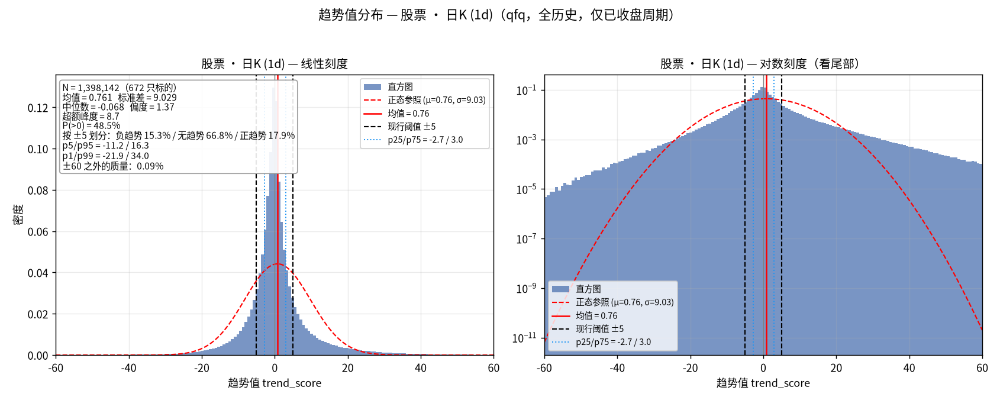
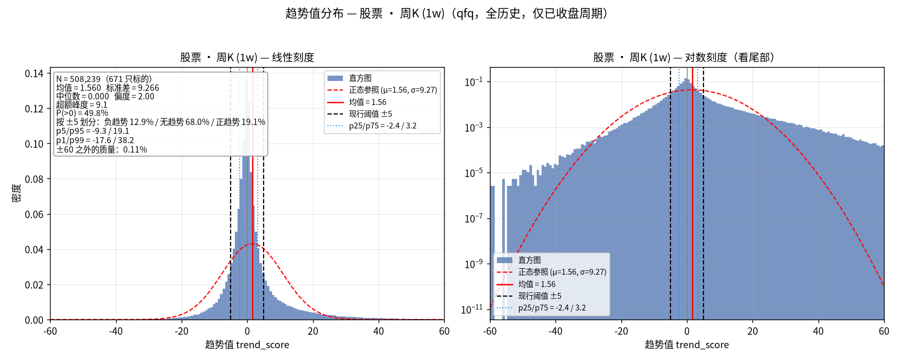
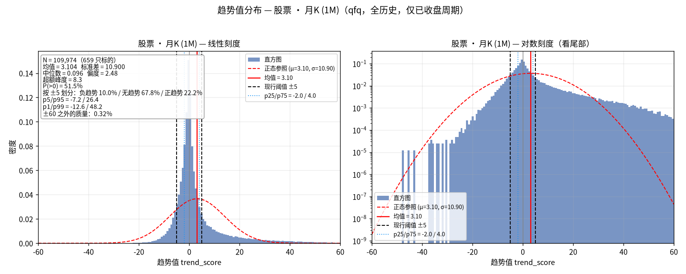
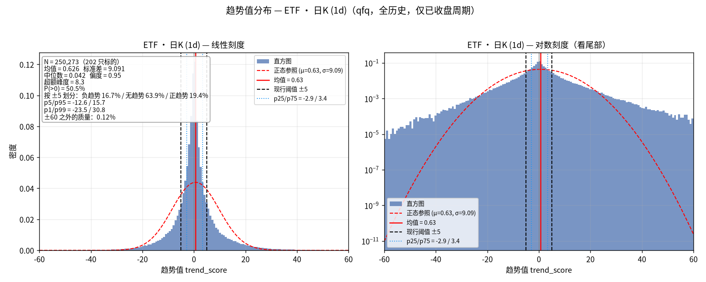
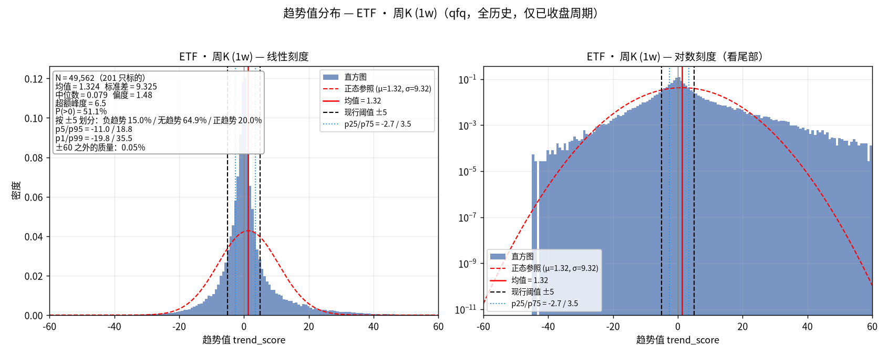
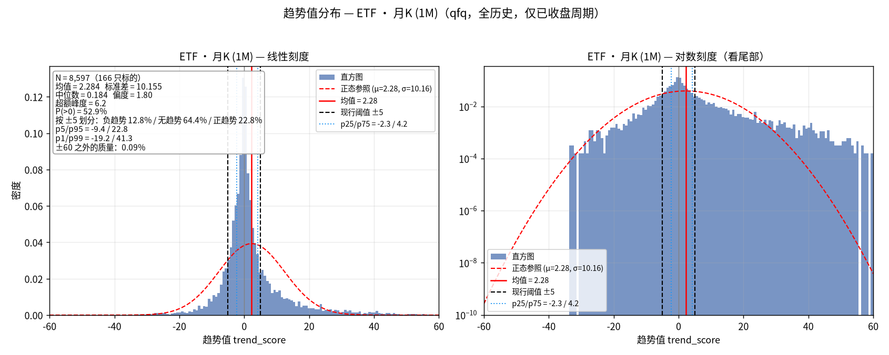

# 趋势值（trend_score）分布研究：股票/ETF × 日/周/月 六组分布

> 日期：2026-09-12
> 状态：已完成（数据、图、脚本均在本目录，可复现）
> 关联文档：`docs/26-09-12-周月K/2026-09-12-周月K-方案.md`（周/月K 落库是本次研究的数据前提）

## 1. 研究背景

系统的趋势值（`trend_score`，量纲 [-100, 100]）目前按经验阈值 ±5 划分
「趋势启动/结束」（`core/trend.py::_detect_trend_phase`）。这个阈值是拍脑袋定的，
没有数据支撑。

先验猜想（需求方提出）：趋势值的分布应该类似一个**均值略正、大部分质量在 0 附近**
的钟形分布——标的大部分时间处于无趋势状态，少部分时间处于正/负趋势中；均值略正
是因为长期看标的整体随宏观经济增长，呈现缓慢的正趋势漂移。

本研究的目的：**用全市场全历史的真实分布来回答**「正趋势 / 无趋势 / 负趋势」
三类的合理分界在哪里，替代经验猜测。恰逢周K/月K 数据落库完成（2026-09-12），
故在日K 之外同时覆盖周/月维度。

## 2. 研究方法

**分组**：标的类型（股票 / ETF）× K线周期（日 / 周 / 月）= 6 组，分别统计，
不混合。两类标的可能有不同的趋势行为（ETF 是一篮子股票，个体噪声被摊薄）；
三个周期的趋势值参数语义不同（`n=3/5/8` 在日线上是 3/5/8 日，在周/月线上是
3/5/8 周/月），混合会污染分布。

**趋势值口径**：与生产环境完全同源——

- 实现：`core/trend.py::calculate_trend_score_series`（向量化序列形式，
  看板与标的查看页都读它的输出，不存在第二份实现）；
- 配置：`core/strategy_config.py::get_strategy_config()`（DB `app_config` 表，
  缺省 `n=3/5/8, atr=20, er=10, vol_ma=20`）；
- 公式概要：`price_direction = 0.5·tanh(bias_mix/2)·100 + 0.5·tanh(slope_mix)·100`，
  `confidence = min(vol_ratio/3,1)^0.3 · ER(10)^0.7`，
  `trend_score = clip(price_direction · confidence, -100, 100)`。

**数据**：`data/trend_quant.db` 的 qfq（前复权）行情表——
`market_data_qfq`（日）、`market_data_qfq_weekly`（周）、`market_data_qfq_monthly`（月）。
周/月 qfq 为 vendor 直接给的前复权结果（周期 bar 可能跨除权日，无法由 raw 本地
物化，见周月K方案 §2.2）。**仅已收盘周期**（进行中的当周/当月不在库内，天然剔除）。

**样本处理**：

- 标的池 = `instrument_metadata` 中 `asset_type ∈ {stock, etf}` 的全部标的
  （672 只股票 + 202 只 ETF），不按 enabled 过滤；
- 每根 K 线算一个趋势值；预热期（`max(n_long, atr_period)+2 = 22` 根）输出 NaN，剔除；
- 六组分别汇总为池化（pooled）分布：所有标的 × 所有历史 bar 合在一起。

**统计量**：N、均值、标准差、中位数、偏度、超额峰度、P(>0)、
分位数（p0.5~p99.5）、按现行 ±5 阈值的三类占比。

## 3. 数据

| 组 | 趋势值样本数 N | 覆盖标的数 | 行情覆盖区间 |
|---|---|---|---|
| 股票·日 | 1,398,142 | 672 | 1993-07 ~ 2026-09-11 |
| 股票·周 | 508,239 | 671 | 1991-01 ~ 2026-09-11 |
| 股票·月 | 109,974 | 659 | 1991-01 ~ 2026-08-31 |
| ETF·日 | 250,273 | 202 | 2005-02 ~ 2026-09-11 |
| ETF·周 | 49,562 | 201 | 2005-02 ~ 2026-09-11 |
| ETF·月 | 8,597 | 166 | 2005-02 ~ 2026-08-31 |

注：月K 止于 2026-08-31 是因为 2026-09 的月 bar 尚未收盘，按「未收盘周期不落库」
约定不在库内；股票周/月K 起点（1991）早于日K（1993），是 vendor 周期接口的
历史深度大于本地日K 回填范围所致。ETF·月 只有 166 只——上市不足 22 个月的
ETF 出不了趋势值（预热门槛按根数计），且 ETF 整体上市较晚，N 明显小于其他组。

## 4. 结果

| 组 | 均值 | 标准差 | 中位数 | 偏度 | 超额峰度 | P(>0) | 按 ±5：负/无/正 |
|---|---|---|---|---|---|---|---|
| 股票·日 | 0.76 | 9.03 | -0.07 | 1.37 | 8.7 | 48.5% | 15.3% / 66.8% / 17.9% |
| 股票·周 | 1.56 | 9.27 | 0.00 | 2.00 | 9.1 | 49.8% | 12.9% / 68.0% / 19.1% |
| 股票·月 | 3.10 | 10.90 | 0.10 | 2.48 | 8.3 | 51.5% | 10.0% / 67.8% / 22.2% |
| ETF·日 | 0.63 | 9.09 | 0.04 | 0.95 | 8.3 | 50.5% | 16.7% / 63.9% / 19.4% |
| ETF·周 | 1.32 | 9.32 | 0.08 | 1.48 | 6.5 | 51.1% | 15.0% / 64.9% / 20.0% |
| ETF·月 | 2.28 | 10.16 | 0.18 | 1.80 | 6.2 | 52.9% | 12.8% / 64.4% / 22.8% |

图中红色虚线为同均值/方差的正态分布参照，黑色虚线为现行 ±5 阈值，
蓝色点线为 p25/p75（中间 50% 区间边界）。

### 股票







### ETF







## 5. 结果分析

**「均值缓慢为正」成立，且随周期变粗而增强。** 六组均值全部为正：
日 ~0.7 → 周 ~1.3~1.6 → 月 ~2.3~3.1。周期越长，长期增长漂移在单根 bar 的
趋势读数里积累得越多，与「宏观正增长 → 缓慢正趋势」的猜想方向一致。
但注意均值相对标准差很小（月K 股票也才 3.1 vs σ=10.9），单根 bar 读数的
信噪比低，「缓慢」二字是准确的。

**不是正态分布，而是尖峰厚尾。** 超额峰度 6~9（正态为 0）。线性刻度图里实际
分布在 0 附近的峰远比正态参照尖锐；对数刻度图里 ±20 以外的尾部衰减远慢于
正态参照（正态在 ±30 已到 1e-9 以下，实际还在 1e-4~1e-5 量级）。含义：
「无趋势」比正态假设下更集中（大部分 bar 的趋势值非常接近 0），
而「强趋势」出现的频率远高于正态预测。猜想中的「方差 3」量级不对——
实际标准差 9~11，且方差本身不是好的离散度描述（厚尾）。
趋势值有界（±100 clip + tanh 饱和），两端在 ±60 以外几乎无质量（<0.3%）。

**显著右偏：正趋势比负趋势更多、更强。** 偏度 1.0~2.5，全部为正。
中位数 ≈ 0 而均值 > 0，是右偏分布的典型形态。月K 上最极端：股票
P(≥5)=22.2% vs P(≤-5)=10.0%，正趋势频率是负趋势的两倍多。这同样与
长期增长漂移自洽：下跌行情倾向于短促剧烈（但 tanh 饱和压住了幅度），
上涨行情则更常见、持续更久。

**股票与 ETF 的差异不大。** 形状同族，ETF 的偏度（0.95~1.8）略低于股票
（1.37~2.48），均值略低——符合「篮子摊薄个体噪声」的预期，但差异是
量级的而非本质的。两类标的可以共用同一套阈值，不必分别标定。

## 6. 对三类划分的启示

1. **现行 ±5 阈值有数据支撑，不算离谱**：它把 64~68% 的 bar 划入「无趋势」，
   与「大部分时候无趋势」的先验吻合；中间 50% 区间（p25~p75）约 [-3, +3.5]，
   ±5 比它略宽，落在合理范围的宽端。
2. **对称阈值 + 右偏分布 ⇒ 正/负趋势占比天然不等**（如月K 股票 22% vs 10%）。
   这是分布的真实性质，不是阈值的问题。若业务上希望「正/负趋势出现频率相当」，
   阈值必须不对称：大约 [-5.5, +7] 能让日K 两侧各占 ~15%；月K 的偏移更大。
   建议保持对称阈值、接受占比不等（它反映了真实的多空不对称），
   除非下游逻辑对两侧频率敏感。
3. 「均值±1σ」（约 [-8, +12]）会把 ~85% 划入无趋势，对「少部分时间有趋势」
   的语义来说偏宽，不建议。
4. 若未来要按周期分别定阈值：三周期的分布在形状上高度相似（σ 都在 9~11），
   但均值漂移不同（0.7/1.4/2.3~3.1）。若阈值想锚定「偏离无趋势中枢」，
   月K 可考虑把中枢从 0 移到 ~2~3（即阈值 ~[-2.5, +8] 之类），
   日/周K 直接沿用 0 中枢即可。

## 7. 局限与注意事项

- **池化分布混合了横截面与时间维度**：同一标的相邻 bar 的趋势值高度自相关，
  有效样本量远小于 N；分布形状可信，但小份额尾部的精确比例不宜过度解读。
- **ETF·月 样本小**（166 只 / 8,597 个值），读数置信度低于其他五组。
- 停牌/零成交 bar 的趋势值退化为 0（confidence=0），实测精确为 0 的值仅占
  0.03%~0.8%，对分布无实质影响，未做剔除。
- 分布是**全历史**口径，未按市场环境（牛/熊/震荡年代）分层；若阈值用于
  择时类逻辑，后续可按年份分层再看稳定性。
- 趋势值公式中 `vol_ratio/3.0` 的饱和常数、`±5` 相位阈值等本来就是按日K
  标定的（见周月K方案 §13.2）；本报告给出的是现状公式下的实测分布，
  改公式参数后分布需重跑。

## 8. 复现

```bash
# 1) 计算（用生产 venv，读生产库，输出 data/*.npy + data/stats.json）
.venv/bin/python research/2026-09-12_趋势值分布/trend_score_distribution.py

# 2) 绘图（隔离 venv，避免给生产环境引入 matplotlib）
python3 -m venv scripts/temp/plot-venv   # 已存在则跳过
scripts/temp/plot-venv/bin/pip install matplotlib
scripts/temp/plot-venv/bin/python research/2026-09-12_趋势值分布/plot_trend_distribution.py
```

依赖说明：计算脚本只需项目自身依赖（numpy/pandas）；绘图脚本只需
matplotlib + numpy。中文字体（`fonts/NotoSansCJKsc-Regular.otf`，OFL 协议）
不入库，绘图脚本运行时若缺失会自动从 noto-cjk 仓库下载（需联网）。

**git 管理口径**（见 `research/.gitignore`）：`data/*.npy` 原始样本（~18MB）
与字体文件（~16MB）为可再生产物，不入库——前者由计算脚本 ~90s 重新生成，
后者由绘图脚本自动下载；`data/stats.json`（报告引用的权威数字）与六张
`dist_*.png`（报告插图）随库管理。

## 9. 目录内容

| 文件 | 说明 | 入库 |
|---|---|---|
| `trend_score_distribution.py` | 统计计算脚本（生产 venv 运行） | ✓ |
| `plot_trend_distribution.py` | 绘图脚本（隔离 plot-venv 运行） | ✓ |
| `data/stats.json` | 六组描述性统计（含完整分位数） | ✓ |
| `dist_*.png` | 六张分布图（本报告引用） | ✓ |
| `data/{stock,etf}_{daily,weekly,monthly}.npy` | 六组趋势值原始样本（可再生） | ✗ gitignore |
| `fonts/NotoSansCJKsc-Regular.otf` | 绘图中文字体（运行时自动下载） | ✗ gitignore |
