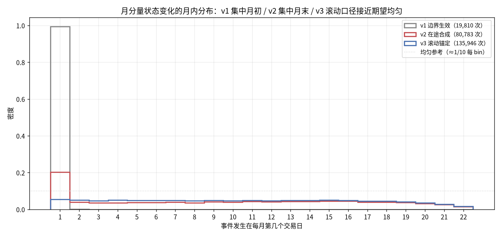
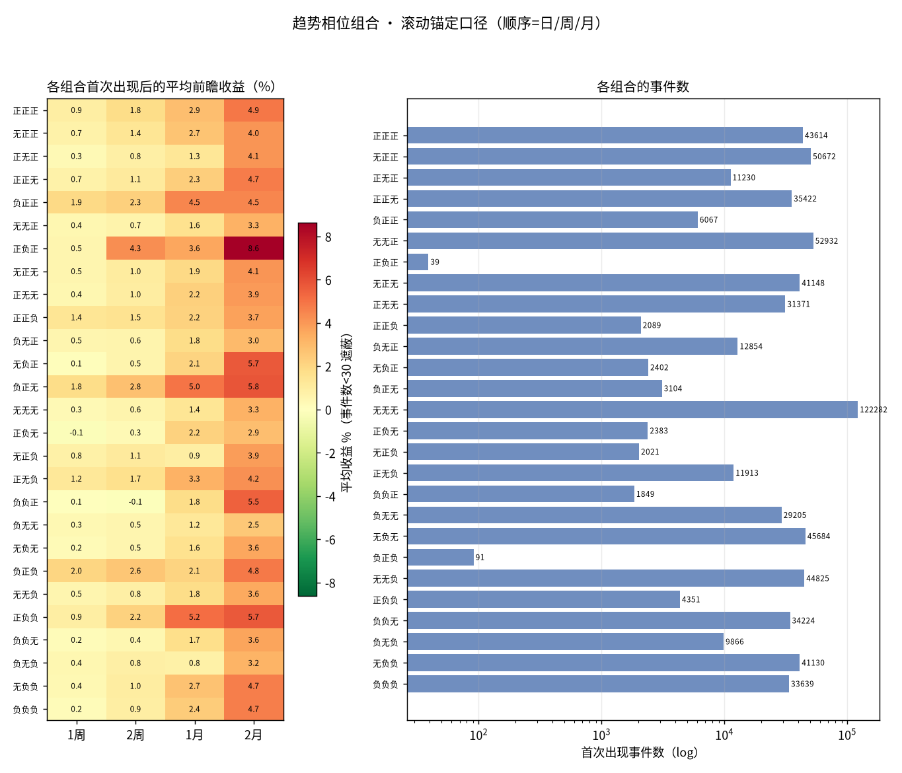
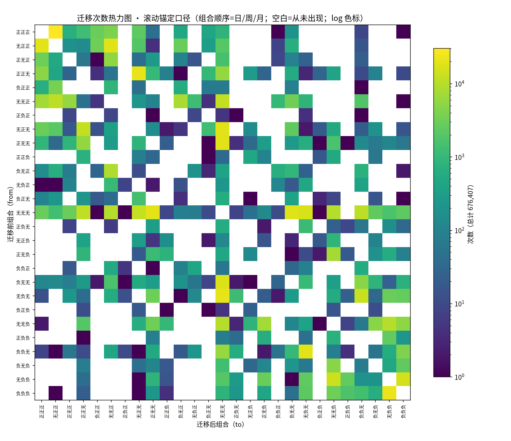
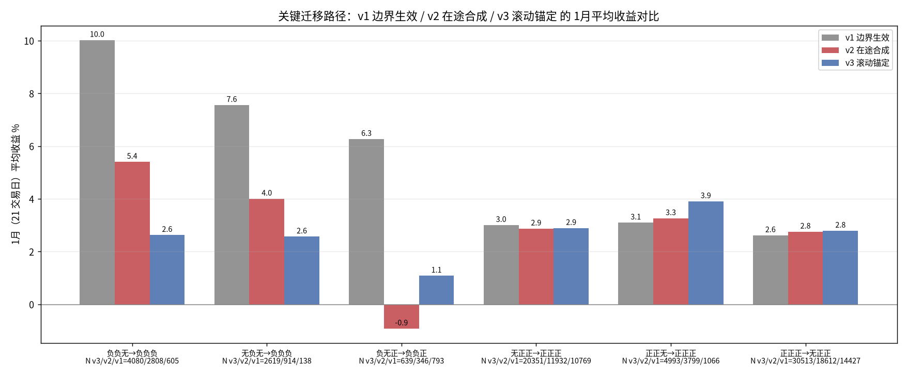
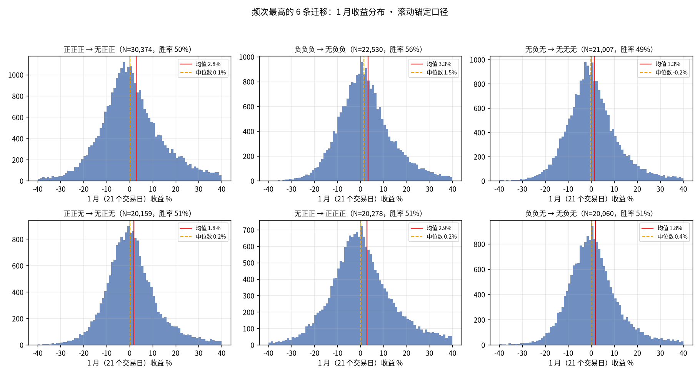
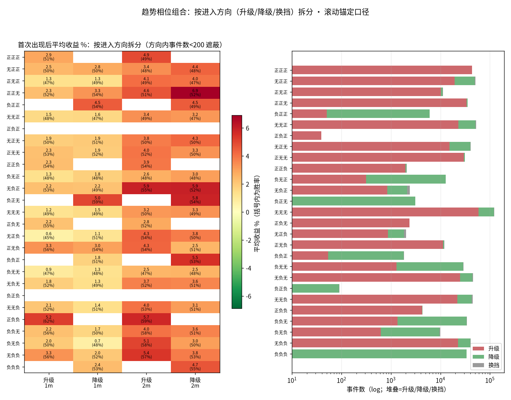

# 趋势相位迁移（滚动锚定版 v3）：周/月趋势每日重新锚定的 27 组合研究

> 日期：2026-09-13
> 状态：已完成（数据、图、脚本均在本目录，可复现）
> 前置研究：`research/2026-09-13_phase-migration/`（v1，边界生效口径）、
> `research/2026-09-13_phase-migration-live-synth/`（v2，在途合成口径）——
> 本研究是同一系列的第三版，事件/收益/统计口径与前两版逐项一致，
> 唯一差别是周/月级趋势状态改用**滚动锚定**口径（`src/core/rolling_bars.py`）。
>
> **后续版本**：本目录数字基于周/月 ±5 阈值；2026-09-14 起三态阈值调整为
> 日 ±5 / 周·月 ±9（依据 `2026-09-13_rolling-trend-calibration` 的分布标定），
> 同口径新阈值版见 `research/2026-09-14_phase-migration-th9/`（v4，优先采用）。

## 1. 研究背景

三版研究回答的是同一个问题（日/周/月三态 27 组合的首次出现收益与迁移路径），
差别只在周/月级状态「每天收盘后到底能看到什么」：

- **v1（边界生效）**：周/月状态在周期收盘后的第一个交易日才生效——信息滞后，
  月级变化 99.6% 落在每月前 3 个交易日，周期中后段的行情完全漏掉；
- **v2（在途合成）**：把在途周/月 bar 用日K 累计合成、逐日计算——解决了滞后，
  但暴露三个口径问题：(a) **量能阻尼**：月初在途 bar 累计成交量小，
  `volume_factor` 把 confidence 系统性压向 0，月/周初状态几乎恒为「无」
  （「无无无」占全部有效交易日 48.4%）；(b) **TR/量能在周期内爬坡**，
  同一指标在月初和月末不是同一尺度；(c) 后果是月分量变化集中在**月末**
  （月末最后几天占比最高），月初恒无变化——信号可见时机仍被周期结构扭曲；
- **v3（本版，滚动锚定）**：第 t 日的周/月 bar 序列**每天重新锚定到当日**——
  第 k 根 bar = 截至当日的倒数第 k 个 D 交易日窗口（周 D=5、月 D=22，右闭）。
  每根 bar 恒为满 D 个交易日 → 无周期内量能/TR 爬坡，无月初阻尼；
  相邻 bar 的 close 间距恒为一个周期 → 无拼接间距 artifact；
  第 t 日序列只含 [t−K·D+1, t] 的日K → 严格 PIT 无前视。
  预期效果：月分量状态变化在月内**接近均匀分布**——这是本版的关键验证点（§3）。

同时按滚动口径把周期窗口参数折算到与周期匹配的尺度（周 ATR8/ER4、
月 ATR6/ER3，见 §2.1），替代 v1/v2 直接套用日K 参数（ATR20/ER10）的做法。

## 2. 口径与方法

### 2.1 滚动锚定 bar 与趋势参数

- 周 bar：窗口 = 5 个交易日；月 bar：窗口 = 22 个交易日（固定交易日数，
  不用自然周/月框定，每根 bar 严格同尺度）；bar 的 OHLCV = 窗口内
  首日 open、区间 max/min、末日 close、成交量求和；
- 趋势值复用 canonical 公式（`core/trend.py::calculate_trend_score_series`）
  的全部结构：MA/EMA 3/5/8、tanh 除数、bias/slope 权重 0.4/0.4/0.2、
  0.3/0.7 指数、±100 clip **均不动**；仅窗口参数按周期折算：

  | 参数 | 日（默认） | 周 | 月 |
  |---|---|---|---|
  | atr_period | 20 | 8 | 6 |
  | vol_ma_period | 20 | 8 | 6 |
  | er_period | 10 | 4 | 3 |

- 预热门：完整 bar 数 ≥ max(n_long, atr_period)+2 = 10 且 ATR>0 →
  周约 50 个交易日、月约 220 个交易日内无值（当日组合无效，剔除）；
- 日级与 v2 完全相同：`calculate_trend_score_series` + DB strategy 默认 cfg；
- **±5 阈值与 trend_ma5 不动**：三态仍由 trend_score 按 >5 正 / <−5 负 /
  其余无 切分（与 v1/v2 一致）；canonical 公式同步输出的 trend_ma5/trend_ma10
  结构未做任何改动，本研究事件判定与 v2 一样只用 trend_score。
- 实现：日频逐日调用 `rolling_period_trend_series` 直接得到整条周/月趋势值
  序列（(T,K) numpy 向量化），不再需要 v2 的 PeriodState 增量合成机制。
  **精确性自检**：抽 60 只有数据的标的各 1 天，用 `rolling_period_frame`
  拼出当日 bar 序列喂生产函数，与向量化解逐点比对——120 个样本点
  max|Δ| = **5.3e-14**（浮点噪声级），有效/无效判定零不一致。

### 2.2 与 v2 逐项一致的口径

>5 正 / <−5 负 / 中间无；组合 (日,周,月) 在相邻有效交易日间变化记一次事件
（首次出现=从别的组合切过来）；前瞻收益 = 事件日收盘 → 其后 5/10/21/42 个
交易日收盘（≈1周/2周/1月/2月），末尾窗口不足分别剔除；27×27 迁移矩阵；
方向拆分（delta = sum(to) − sum(from) 的符号 → 升级/降级/换挡）与
`dir_split.py` 完全相同；标的池为 `instrument_metadata` 的 stock+etf；
`combo_stats.csv` / `transition_stats.csv` / `summary.json` 的 schema 与 v2
逐项一致（summary 增加 v3 口径与参数说明）。

### 2.3 样本

- **676,407 次**迁移事件（v2 571,148，+18%；v1 496,988）、855 只标的
  （v2 831）、**393 条**不同迁移路径（v2 380、v1 449）；
- 事件日期 1994-06-15 ~ 2026-09-11；有效标的日 1,476,797；
- 分量变化次数：日 442,381 / 周 261,684（v2 178,671）/ 月 **135,946**
  （v2 80,783、v1 19,810）；仅日级变化的事件占 **45.8%**（v2 58.0%、v1 79.5%）。

## 3. 关键验证：月分量变化的月内分布接近期望均匀



月分量状态变化落在「每月第几个交易日」的分布（三版对比）：

| 口径 | N | 月初（1~3 日） | 月末（倒数 3 日） | 1~15 日各 bin 占比 max/min |
|---|---|---|---|---|
| v1 边界生效 | 19,810 | **99.6%** | 0.0% | ≈9850（极端集中） |
| v2 在途合成 | 80,783 | 27.5% | 14.2% | 5.81（前低后高，偏月末） |
| **v3 滚动锚定** | **135,946** | **15.2%** | **15.8%** | **1.17（接近均匀）** |

v1 的边界效应与 v2 的量能阻尼效应在滚动口径下基本消除：月级状态变化
在月内各交易日近似均匀（头尾略高各 ~15%，中间平坦），与「每天都有等权的
新信息进入滚动窗口」的口径性质一致。这是本版成立的直接证据。

结构后果：量能阻尼消失后，极端组合不再是稀有事件——「无无无」占有效交易日
**24.2%**（v2 48.4%、v1 34.7%），「正正正」**7.4%**（v2 5.3%、v1 2.9%）、
「负负负」**5.6%**（v2 1.8%、v1 1.0%）。

## 4. 结果

### 4.1 27 组合首次出现后收益（v3）



代表组合四窗口（均值 / 胜率）：

| 组合 | 事件数 | 期间占比 | 1周（5日） | 2周（10日） | 1月（21日） | 2月（42日） |
|---|---|---|---|---|---|---|
| 正正正 | 43,614 | 7.4% | +0.92% / 49% | +1.78% / 51% | +2.89% / 51% | +4.86% / 49% |
| 无正正 | 50,672 | 7.1% | +0.68% / 49% | +1.38% / 50% | +2.67% / 50% | +4.04% / 48% |
| 负正正 | 6,067 | 0.5% | +1.91% / 57% | +2.28% / 55% | +4.46% / 54% | +4.51% / 49% |
| 无无无 | 122,282 | 24.2% | +0.31% / 49% | +0.56% / 49% | +1.38% / 49% | +3.26% / 50% |
| 负负无 | 34,224 | 4.4% | +0.19% / 50% | +0.44% / 49% | +1.69% / 51% | +3.65% / 51% |
| 无负负 | 41,130 | 5.8% | +0.40% / 51% | +0.98% / 51% | +2.70% / 54% | +4.71% / 55% |
| 正负负 | 4,351 | 0.4% | +0.88% / 52% | +2.18% / 56% | **+5.18% / 62%** | +5.71% / 59% |
| 负正无 | 3,104 | 0.2% | +1.77% / 57% | +2.81% / 58% | **+4.99% / 59%** | +5.80% / 54% |
| 负负负 | 33,639 | 5.6% | +0.19% / 49% | +0.90% / 50% | +2.36% / 53% | +4.68% / 55% |

（完整 27 行 × 四窗口全套统计见 `data/combo_stats.csv`）

**v1/v2 的「三空齐备反转梯度」在 v3 消失**：负负负 对 正正正 的 1月均值差
从 v1 的 +2.1pp（+4.99% vs +2.91%）、v2 的 +0.9pp（+4.14% vs +3.26%）
变为 v3 的 **−0.5pp**（+2.36% vs +2.89%）——「首次三空齐备买入」的
组合层面优势基本被证实是前两版的**计时 artifact**（v1 的边界滞后 +
v2 的量能阻尼都让信号确认偏晚，把已经发生的反弹计入前瞻收益）。
仍然偏强的组合是「日级与周/月级反向」的结构：**正负负**（+5.18%/62%）、
**负正无**（+4.99%/59%）、**负正正**（+4.46%/54%）——日级逆势深入、
周/月趋势尚未转向的组合，且从 1周 起就有区分度（负正无 1周 +1.77%/57%）。

### 4.2 迁移频次矩阵（v3）



- 频次榜首不再全是日级翻转：正正正→无正正（30,513 次）、负负负→无负负
  （22,649 次）居前——周/月分量每天可变后，三多/三空的「瓦解第一步」
  成为最常见事件；
- **负负负→正正正 仍为 0 次**；但 **正正正→负负负 发生了 1 次**
  （301236.SZ，2023-03-22，1月 +32.5%）——滚动口径下三级状态每天都可
  重估，理论上不再要求边界重合。该标的当时上市不久、各分量在 ±5 附近
  剧烈抖动（前后一个月内 正正正⇄负负负 方向反复多次），属于阈值噪声
  样本而非结构性信号（§6）；
- 月分量「正⇄负」跳变（不经过「无」）出现 7 次（v2 为 0）——滚动 bar
  逐日重锚使月级可以快变，但 7/135,946 的占比说明跳变依然极稀有，
  月级状态以「经过无」的渐变为主。

### 4.3 与 v1/v2 的关键路径对比



关键迁移的 1月平均收益（v3 / v2 / v1）：

| 迁移 | N v3/v2/v1 | v3 | v2 | v1 | 三版走势 |
|---|---|---|---|---|---|
| 负负无→负负负 | 4,080 / 2,808 / 605 | +2.63% / 55% | +5.40% / 61% | +10.02% / 77% | **一路衰减，接近基线** |
| 无负无→负负负 | 2,619 / 914 / 138 | +2.56% / 55% | +4.00% / 60% | +7.55% / 69% | 同上 |
| 负无正→负负正 | 639 / 346 / 793 | +1.08% / 47% | −0.92% / 43% | +6.26% / 64% | v1 幻象，v2/v3 无edge |
| 无正正→正正正 | 20,351 / 11,932 / 10,769 | +2.89% / 51% | +2.87% / 49% | +3.00% / 50% | 三版稳定 |
| 正正无→正正正 | 4,993 / 3,799 / 1,066 | +3.90% / 53% | +3.26% | +3.09% | 稳定，v3 略升 |
| 正正正→无正正 | 30,513 / 18,612 / 14,427 | +2.79% / 50% | +2.75% / 49% | +2.61% / 49% | 三版稳定 |

结论清晰：**「最后一空落位」（负负无→负负负）这条 v1 旗舰路径的 +10%/77%，
在逐版消除计时 artifact 后衰减到 +2.6%/55%**——与无信息基线
（无无无 的 +1.38%/49%）的差距只剩约 1.2pp/6pp，超跌反弹效应存在但
远比 v1/v2 显示的薄；而动量类路径（右侧三条）三版数字几乎不变——
它们的信号形成本来就不受边界/阻尼影响，口径修正对它们是中性的。

1月均值 TOP（N≥300）：无正正→负正无 +8.11%/63%（N=316）、
正负负→正无负 +7.67%/71%（N=624）、正正正→负正无 +6.71%/65%（N=434）、
正负负→无无负 +5.66%/62%（N=741）、无负负→正负负 +5.52%/63%（N=2,549）
——共性是「日级快速逆势深入而周/月尚未转向」或「三空瓦解初期」，
而非「三空齐备」本身。BOTTOM（N≥300）：无正无→无无负 −0.59%/48%（N=532）
等「周/月转空初期」路径，绝对值都很小。

### 4.4 头部迁移的收益分布（v3）



与前两版形态一致：接近对称钟形、σ≈9~10%，高频迁移胜率 49~56%——
单条高频迁移区分度有限。

### 4.5 按进入方向拆分：升级 / 降级 / 换挡

拆分口径与 v2 完全相同（delta = sum(to) − sum(from)：>0 升级 / <0 降级 /
=0 换挡）。全部事件中 升级 329,294 / 降级 334,196 / 换挡 12,917 次。



拆分差异最大的组合（1月均值/胜率，升级 vs 降级）：

| 组合 | 升级进入 | 降级进入 | 差值 |
|---|---|---|---|
| 无负负 | +3.29% / 56%（N=22,649） | +2.00% / 52%（N=17,414） | +1.3pp |
| 负无负 | +1.96% / 50%（N=625） | +0.70% / 48%（N=8,995） | +1.3pp |
| 正正无 | +2.26% / 52%（N=33,948） | +3.25% / 54%（N=1,271） | −1.0pp |
| 无无负 | +2.07% / 52%（N=21,998） | +1.36% / 51%（N=21,161） | +0.7pp |
| 负负无 | +2.22% / 56%（N=1,349） | +1.66% / 50%（N=32,595） | +0.6pp |

**方向拆分的差异整体大幅压缩**：v2 中差异最大的 负负无 达 6.6pp
（升级 +8.81%/72% vs 降级 +2.23%/53%），v3 只剩 0.6pp——v2 那个
「三空开始修复」的强信号，相当部分是量能阻尼的计时 artifact
（阻尼下月级修复的确认被推迟到反弹已在途的月末）。v3 里方向拆分仍然
成立（升级进入普遍略优），但已不构成主要的收益区分轴。

（27 组合 × 3 方向 × 4 窗口全套统计见 `data/combo_dir_stats.csv`；
方向内 N<200 的单元格在图中遮蔽。）

## 5. 结论

1. **口径结论**：滚动锚定消除了 v1 的边界滞后与 v2 的量能阻尼/TR 爬坡/
   月初恒无——月分量变化的月内分布从 v1 的 99.6% 集中月初、v2 的偏月末，
   变为接近均匀（max/min 1.17），周/月级状态真正成为「每天等权可见」的量。
2. **效应结论**：v1 旗舰「抄底」路径的收益在 v1→v2→v3 单调衰减
   （负负无→负负负：+10.0% → +5.4% → +2.6%），组合层面的三空反转梯度
   在 v3 归零（负负负 vs 正正正 −0.5pp）——该效应的大半是三版逐次排除的
   计时 artifact，剩余部分（约 1~1.5pp）仍在但已不肥厚。
3. **仍然成立的结构**：日级与周/月级反向的组合（正负负 +5.2%/62%、
   负正无 +5.0%/59%、负正正 +4.5%/54%）与对应的 TOP 迁移路径
   （无正正→负正无 +8.1%/63% 等）在滚动口径下保持强度，且 1周 窗口起就有
   区分度——系列研究中真正稳健的信号是「日级逆势深入、周/月未转向」，
   而不是「三空齐备」。
4. **动量类路径口径中性**：无正正→正正正、正正正→无正正 等三版数字
   几乎不变，作为条件先验可直接沿用。
5. 使用建议与 v2 相同：迁移表作为**条件先验**而非直接交易信号；v3 数字
   与「每天真实可见信息」最对齐，优先采用本目录口径；事件噪声仍在
   （月分量变化 v3 增至 13.6 万次，含 ±5 附近的反复穿越），按信号交易需
   防抖（连续 N 日站稳或结合 trend_ma5）。

## 6. 局限

- 继承前序全部局限：截面相关（regime 切换时大量标的同日触发同一条迁移，
  有效样本 << 名义 N）、幸存者偏差、未按年代/牛熊分层、未计成本、
  相邻 horizon 窗口重叠；
- 滚动 bar 由 qfq 日K 聚合，与 vendor 周期表无直接对应；除权日附近的
  qfq 口径缝对趋势值影响远小于 ±5 阈值步长（自检差值已含此因素）；
- 滚动窗口使周/月级状态每天都在重估，±5 阈值附近的抖动会产生「噪声事件」
  （如 §4.2 的 正正正→负负负 1 次与月分量 正⇄负 跳变 7 次），
  低频极端路径的单次事件不宜过度解读；
- 月级预热 220 个交易日（周 50），上市不足约一年的标的月分量无值，
  与 v2（需 22 根已收盘月K）覆盖范围相近但不完全相同（本版 855 只有事件，
  v2 831 只；事件起点也提前到 1994-06-15）；
- 周期窗口参数（周 ATR8/ER4、月 ATR6/ER3）是按 bar 尺度折算的新设定，
  未做参数敏感性检验，换参数需重跑。

## 7. 复现

```bash
# 1) 计算（生产 venv，只读生产库；含精确性自检，不一致会拒绝落盘）
.venv/bin/python research/2026-09-13_phase-migration-rolling/trend_phase_rolling.py

# 2) 方向拆分 + 绘图（隔离 plot-venv；对比图会读取前两版研究目录的数据）
scripts/temp/plot-venv/bin/python research/2026-09-13_phase-migration-rolling/dir_split.py
scripts/temp/plot-venv/bin/python research/2026-09-13_phase-migration-rolling/plot_phase_rolling.py
```

git 口径：与既有约定一致——`data/events.csv`（~86MB 明细）与 `fonts/`
不入库可再生；聚合 CSV 与图入库。

## 8. 目录内容

| 文件 | 说明 | 入库 |
|---|---|---|
| `trend_phase_rolling.py` | 滚动锚定版事件计算（含精确性自检） | ✓ |
| `dir_split.py` | 按进入方向（升级/降级/换挡）拆分组合收益 | ✓ |
| `plot_phase_rolling.py` | 绘图脚本（隔离 plot-venv） | ✓ |
| `data/summary.json` | 元信息（v3 口径与参数、自检结果） | ✓ |
| `data/combo_stats.csv` | 27 组合聚合（v3） | ✓ |
| `data/combo_dir_stats.csv` | 27 组合 × 3 方向 × 4 窗口拆分统计 | ✓ |
| `data/transition_stats.csv` | 393 条迁移路径聚合（v3） | ✓ |
| `data/trading_calendar.csv` | 全样本交易日历 + 月内第几个交易日 | ✓ |
| `data/events.csv` | 676,407 条事件明细（可再生） | ✗ gitignore |
| `heatmap_transition_counts.png` | 迁移次数热力图 | ✓ |
| `combo_returns_heatmap.png` | 27 组合收益 + 频次 | ✓ |
| `combo_dir_split.png` | 27 组合 × 方向拆分收益热力图 | ✓ |
| `dist_top_transitions.png` | 头部 6 条迁移收益分布 | ✓ |
| `month_change_tdom.png` | 月分量变化的月内分布 v1/v2/v3 对比（关键验证图） | ✓ |
| `compare_v1_v2_v3.png` | 三版关键迁移路径收益对比 | ✓ |
| `fonts/` | 绘图中文字体（从邻近研究目录复制） | ✗ gitignore |
