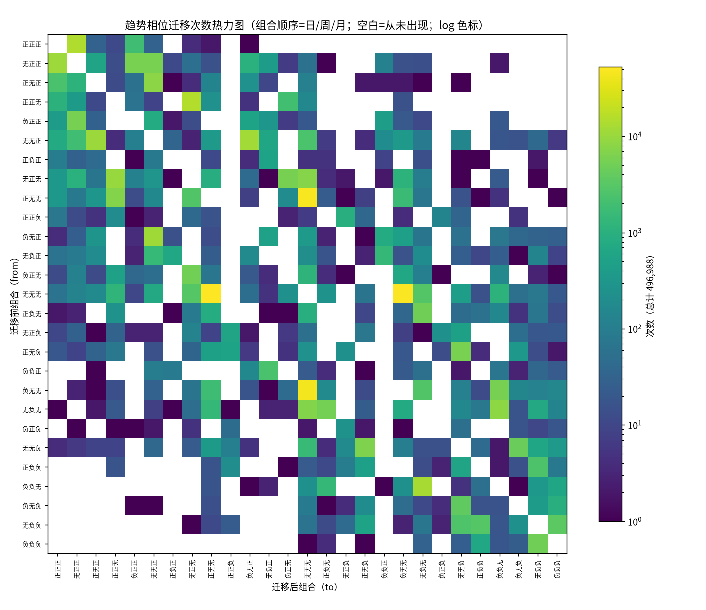
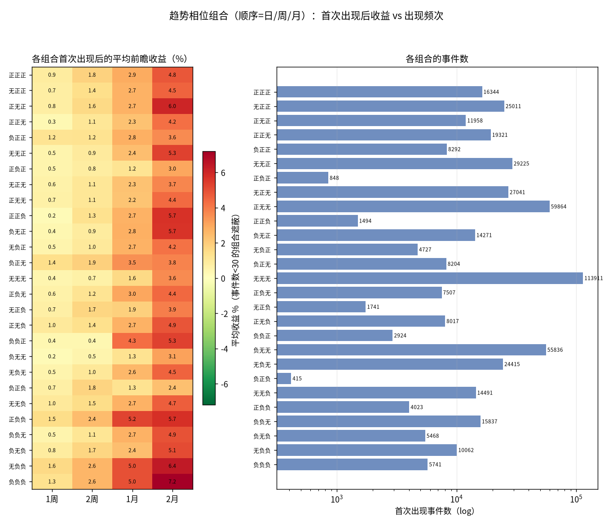
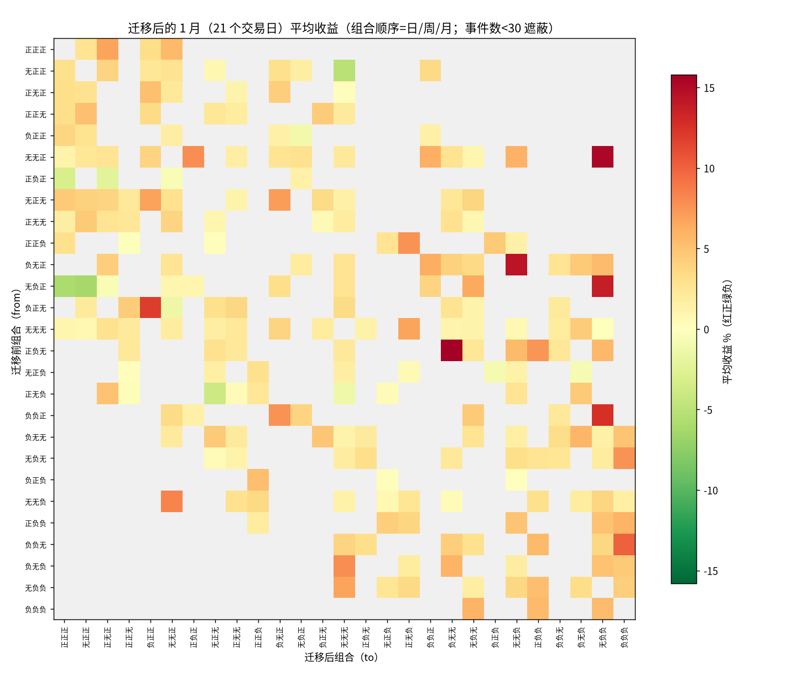
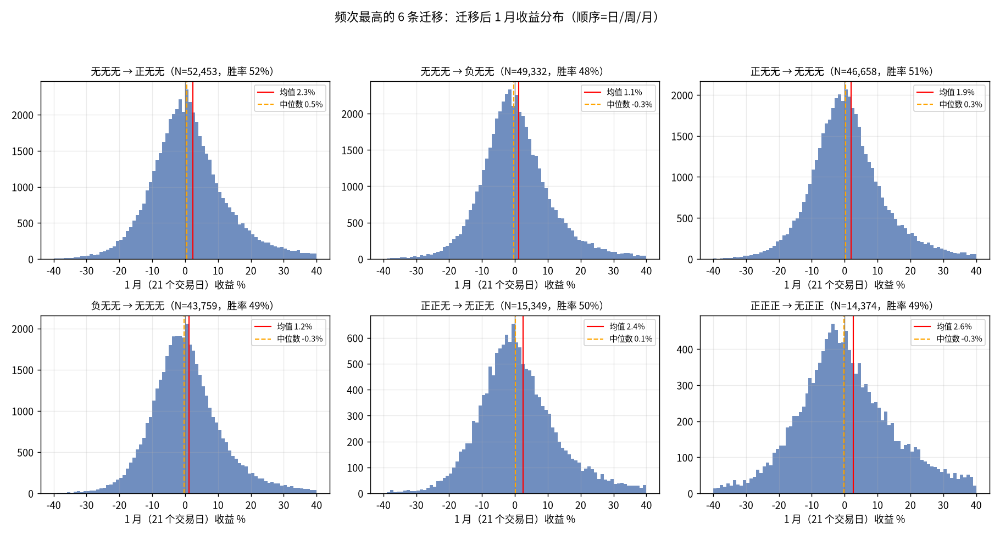
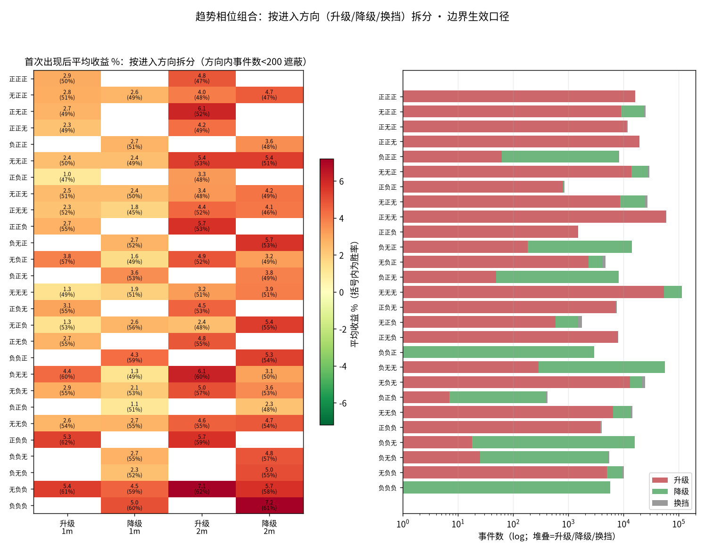

# 趋势相位迁移研究：27 种日/周/月组合的首次出现收益与迁移路径

> 日期：2026-09-13
> 状态：已完成（数据、图、脚本均在本目录，可复现）
> 前置研究：`research/2026-09-12_trend-score-distribution/`（趋势值分布与 ±5 阈值的数据依据）

## 1. 研究背景

按 ±5 阈值把每个周期的趋势值切成三态（>5 正趋势 / <-5 负趋势 / 中间无趋势），
日、周、月三个级别叠加产生 3³=27 种趋势相位组合。本研究回答两个问题：

1. **27 种组合各自「首次出现」后**，标的未来 1周/2周/1月/2月 的收益表现如何？
   「首次出现」的定义（需求方示例）：到 2026-09-01 时 8 月月K 的月趋势首次转正
   （上月为无/负趋势），则 2026-09-01 记为该组合的出现日，从该日起算前瞻收益。
2. **27 种组合之间的迁移**：哪些迁移路径常见、哪些从未发生，以及每条迁移
   发生后收益表现的分布——作为「相位变化 → 未来走势」预测的历史统计依据。

需求方的预判之一：**负负负 → 正正正** 这种三级直接翻转的频次应该极低甚至没有，
而 **正正无 → 正正正** 这类「补全」式迁移会很多。本研究对此做了直接验证（§4.2）。

## 2. 研究方法

### 2.1 口径

| 项 | 约定 |
|---|---|
| 趋势值 | `core/trend.py::calculate_trend_score_series` + DB strategy 配置（与生产同源） |
| 三态划分 | trend_score **> 5** → 正；**< -5** → 负；否则 → 无（预热期 22 根内无值 → 当日组合无效，剔除） |
| 行情 | qfq 前复权；日/周/月三张表；仅已收盘周期（在途周/月 bar 本就不在库内） |
| 生效时机 | **日K：当日收盘生效**；**周K/月K：周期收盘后第一个交易日起生效**（即「8 月月趋势」从 9 月首个交易日可见）。实现：日 t 的周/月状态 = 最近一个标注日严格早于 t 的周期 bar |
| 事件 | 组合 (日,周,月) 在相邻两个有效交易日间变化 → 记一次事件；from=前一组合，to=新组合 |
| 前瞻收益 | 事件日收盘 → 其后 5 / 10 / 21 / 42 个交易日收盘（≈ 1周/2周/1月/2月）；数据末尾不足窗口的事件在该期限剔除 |

### 2.2 标的池与样本

- `instrument_metadata` 中 stock + etf 共 874 只；其中 **825 只**能产生有效事件
  （其余为上市太晚、月K 不足 22 根预热期，三个级别无法同时出值）；
- 事件日期范围 **1995-05-18 ~ 2026-09-11**；
- 全部 **496,988 次**相位迁移事件，覆盖 **449 条**不同的 from→to 路径
  （27×27=729 条理论路径中的 62%）。

### 2.3 结构性事实（迁移矩阵为什么稀疏）

- 周/月状态只在周期边界切换（实测：仅周分量变化的事件 93.8% 落在周一；
  仅月分量变化的事件绝大多数落在每月第 1~3 个交易日，国庆假期等顺延）；
- 因此 79.5% 的事件是「仅日级变化」（395,196 次）；三级同日翻转需要
  日/周/月边界恰好重合且同时反向，实测 **0 次**。

## 3. 数据概览：各组合的出现频次与期间占比

27 种组合出现的频次差异巨大（下图右，log 刻度）：

- **无无无**是市场的默认状态：占全部有效交易日的 **34.7%**，首次出现事件 11.4 万次；
- **正正正** 只占 **2.9%** 的时间，**负负负** 只占 **1.0%** —— 三级别同向
  齐备本身就是稀有事件；
- 日级状态翻转最频繁：正无无（6.0 万次）/ 负无无（5.6 万次）这类「周月无趋势、
  日级单边」的组合是事件大户。



上图为 27×27 迁移次数热力图（log 色标，空白 = 从未出现）。最亮的格子是
「无无无 ⇄ 正无无 / 负无无」（日级进出正/负趋势）各 4~5 万次量级。

## 4. 结果

### 4.1 27 组合首次出现后的前瞻收益



关键数字（胜率为收益>0 占比；全部组合均值均为正，相对比较才有意义）：

| 组合（日/周/月） | 事件数 | 期间占比 | 1周（5日） | 2周（10日） | 1月（21日） | 2月（42日） |
|---|---|---|---|---|---|---|
| 正正正 | 16,344 | 2.9% | +0.89% / 48.6% | +1.80% / 49% | +2.91% / 49.5% | +4.82% / 47.5% |
| 无正正 | 25,011 | 5.7% | +0.74% / 49% | +1.44% / 50% | +2.74% / 49.8% | +4.52% / 47.9% |
| 正正无 | 19,321 | 3.0% | +0.32% / 45.6% | +1.12% / 48% | +2.28% / 49.0% | +4.22% / 48.8% |
| 无无无 | 113,911 | 34.7% | +0.39% / 49.4% | +0.66% / 49% | +1.62% / 50.0% | +3.60% / 50.8% |
| 负负无 | 15,837 | 2.5% | +0.50% / 52.1% | +1.14% / 53% | +2.73% / 55.5% | +4.91% / 56.9% |
| 无负负 | 10,062 | 2.1% | +1.60% / 56.6% | +2.63% / 57% | +4.96% / 60.6% | +6.36% / 59.4% |
| 正负负 | 4,023 | 0.4% | +1.51% / 55.1% | +2.44% / 58% | +5.23% / 62.2% | +5.74% / 58.7% |
| 负负负 | 5,741 | 1.0% | +1.32% / 55.4% | +2.64% / 57% | **+4.99% / 60.3%** | **+7.19% / 61.3%** |

（每格为 均值 / 胜率；完整 27 行 × 四窗口全套统计见 `data/combo_stats.csv`）

**规律一目了然：月/周级别处于负趋势的组合，首次出现后的前瞻收益显著更高、
胜率显著更高；三正齐备反而胜率最低。** 1月均值从 正正正 的 +2.91% 单调爬升到
负负负 的 +4.99%，胜率从 49.5% 升到 60.3% —— 这是 A 股著名的短中期
**反转（超跌反弹）效应**在三周期相位框架下的直接体现。

### 4.2 迁移频次：验证了需求方的预判

- **负负负 → 正正正：0 次**（反向 正正正 → 负负负：也是 0 次）。三级直接
  翻转在 30 年 × 825 只标的上从未发生——结构上就需要日/周/月边界重合且
  同时反向，概率趋于零；
- **进入 正正正 的路径**确实以「补全」为主：无正正→正正正（日级转正补齐）
  10,769 次、正无正→正正正 2,312 次、正正无→正正正（月线转正补齐）1,066 次；
- 最频繁的迁移全是日级单步翻转：无无无→正无无 53,107 次、无无无→负无无
  50,258 次、以及它们的逆过程。

### 4.3 迁移后的收益表现（1月期限，N≥100）



**1月平均收益 TOP（抄底型迁移）**：

| 迁移 | 次数 | 1月均值 | 胜率 |
|---|---|---|---|
| 无负正 → 无负负 | 135 | +13.80% | 80.0% |
| 负负无 → 负负负 | 605 | +10.02% | 76.7% |
| 负负正 → 负无正 | 159 | +7.61% | 66.0% |
| 无负无 → 负负负 | 138 | +7.55% | 68.6% |
| 无正无 → 负正正 | 119 | +6.90% | 59.7% |

**1月平均收益 BOTTOM（追涨受损型迁移）**：

| 迁移 | 次数 | 1月均值 | 胜率 |
|---|---|---|---|
| 正负正 → 正正正 | 100 | **-3.16%** | 31.0% |
| 正无负 → 无无无 | 241 | -1.28% | 42.5% |
| 负正正 → 无负正 | 308 | -1.03% | 42.9% |
| 无正负 → 负正负 | 239 | -0.85% | 44.1% |
| 无负正 → 正无正 | 191 | -0.60% | 39.3% |

几条值得点名的路径：

- **负负无 → 负负负**（月线转负、三空齐备，N=605）：1月 +10.02%、胜率 76.7%、
  2月 +8.26%、胜率 70.0%——「最后一空落位」是历史上最强的买入时点之一；
- **无正正 → 正正正**（日级转正补齐三多，N=10,769，最常见的入三多路径）：
  1月 +3.00%、胜率 50.3%——追随三多齐备只有抛硬币级别的胜率；
- **正正正 → 无正正**（日级率先降温，N=14,427）：1月 +2.61%、胜率 49.1%——
  三多瓦解初期并非立刻下跌，动量衰减是渐进的；
- **正负正 → 正正正**（N=100）：1月 **-3.16%**、胜率 31%——唯一统计上显著为负的
  进入三多路径（日级刚从负转正的急拉，多为反抽末端）。

### 4.4 头部迁移的收益分布形态



六条最高频迁移的 1月收益都接近对称钟形、离散度大（σ≈9~10%），
均值与中位数接近、胜率 48~52% —— **单条高频迁移的预测力有限**，
区分度主要体现在低频但极端的「三空/三多齐备」类迁移上。

### 4.5 按进入方向拆分：升级 / 降级 / 换挡

（2026-09-13 追加）组合层面的数字把「从哪个方向进入该组合」混在了一起：
首次出现 正正无，可以是 无无无→正正无（周级转多，**升级**），也可以是
正正正→正正无（月级降温，**降级**）——含义相反，不应混读。拆分口径：
状态值 正=+1/无=0/负=-1，`delta = sum(to) − sum(from)`，>0 升级 /
<0 降级 / =0 换挡（一级升一级降）。



本口径下拆分差异最大的组合（1月均值/胜率，升级 vs 降级）：

| 组合 | 升级进入 | 降级进入 | 差值 |
|---|---|---|---|
| 负无无 | +4.37% / 60%（N=285） | +1.26% / 49%（N=54,651） | +3.1pp |
| 无负正 | +3.85% / 57%（N=2,335） | +1.56% / 49%（N=1,873） | +2.3pp |
| 无负负 | +5.42% / 61%（N=4,950） | +4.55% / 59%（N=4,392） | +0.9pp |
| 无负无 | +2.86% / 55%（N=13,028） | +2.07% / 53%（N=8,530） | +0.8pp |
| 无正负 | +1.30% / 53%（N=579） | +2.61% / 56%（N=921） | −1.3pp |

两点说明：

- 边界口径下周/月状态只在周期边界变化，「降级进入」某组合的事件常常
  在边界当天与升级事件混合在不同的市场阶段，拆分同样成立；
- 正正无 在本口径下：升级进入 19,285 次（+2.29%/49%），降级进入仅 11 次
  （月级从正回无恰好落在边界且日/周已是正正，结构上稀有）——
  边界口径的方向分布天然偏向升级，这也是它不如在途口径真实的一面
  （见在途合成版 §4.6 的对照，那边 负负无 的拆分差异达 6.6pp）。

（27 组合 × 3 方向 × 4 窗口全套统计见 `data/combo_dir_stats.csv`。）

## 5. 结果分析

1. **三周期相位的确携带了可统计的预测信息**，但方向是反转而非动量：
   月/周级别越空，首次出现后的前瞻收益越高、越稳；三多齐备后收益平庸、
   胜率跌破 50%。「首次出现三空」优于「首次出现三多」。
2. **均值全部为正，相对比较才有意义**：标的池取自当前 `instrument_metadata`，
   不含已退市标的（幸存者偏差），且 A 股长期漂移向上——所有数字都含着这层
   整体水位，绝对值不宜直接当策略预期收益。
3. **胜率与均值的背离**：正正正 的 1月胜率 49.5% 但均值 +2.91%（右尾拉动）；
   负负负 胜率 60.3% 且均值更高——抄底型信号在「均值-胜率」两个维度同时占优。
4. **周/月级别状态是主要的区分轴**：同一 to 组合内，按 from 细分后的收益差
   不如「组合之间」的差异大（对比两张大表）；日级翻转事件贡献了 80% 的样本，
   但预测区分度主要在周/月边界事件上。
5. 用于预测时的现实预期：可把本表当作**条件先验**（某条迁移发生后，
   未来 1~2 月的收益分布长什么样），而不是直接的交易信号——σ≈9% 的分布
   宽度意味着单次事件的不确定性仍然很大。

## 6. 局限

- **截面相关**：市场 regime 切换时上千只标的在同一交易日同时触发同一条迁移，
  有效样本量远小于名义 N（胜率 76.7% 的置信区间没有表面上那么窄）；
- 未按年代/牛熊分层：1995-2026 全样本混合，早期市场（涨跌停、庄股时代）与
  近年结构不同；
- 幸存者偏差（§5.2）；未计交易成本与滑点；
- 相邻 horizon 的事件窗口互相重叠，统计量间不独立；
- 趋势值公式参数按日K 标定后原样用于周/月K（见 `2026-09-12_trend-score-distribution` §6
  与周月K方案 §13.2），换参数需重跑。

## 7. 复现

```bash
# 1) 计算（生产 venv，只读生产库；约 1 分钟）
.venv/bin/python research/2026-09-13_phase-migration/trend_phase_transitions.py

# 2) 绘图（隔离 venv；字体缺失会自动下载）
scripts/temp/plot-venv/bin/python research/2026-09-13_phase-migration/plot_phase_transitions.py
```

git 口径（`research/.gitignore`）：`data/events.csv`（~64MB 明细）不入库、
由计算脚本再生；`combo_stats.csv` / `transition_stats.csv` / `summary.json`
与四张图入库。

## 8. 目录内容

| 文件 | 说明 | 入库 |
|---|---|---|
| `trend_phase_transitions.py` | 事件计算脚本（生产 venv） | ✓ |
| `plot_phase_transitions.py` | 绘图脚本（隔离 plot-venv） | ✓ |
| `dir_split.py` | 按进入方向（升级/降级/换挡）拆分组合收益 | ✓ |
| `data/summary.json` | 元信息（标的数、事件数、口径参数） | ✓ |
| `data/combo_stats.csv` | 27 组合聚合：事件数/占比/各期限收益统计 | ✓ |
| `data/combo_dir_stats.csv` | 27 组合 × 3 方向 × 4 窗口拆分统计 | ✓ |
| `data/transition_stats.csv` | 449 条迁移路径的频次与收益统计 | ✓ |
| `data/events.csv` | 496,988 条事件明细（可再生） | ✗ gitignore |
| `heatmap_transition_counts.png` | 27×27 迁移次数热力图 | ✓ |
| `combo_returns_heatmap.png` | 27 组合 × 4 期限收益 + 频次 | ✓ |
| `combo_dir_split.png` | 27 组合 × 方向拆分收益热力图 | ✓ |
| `heatmap_transition_returns.png` | 27×27 迁移后 1月平均收益 | ✓ |
| `dist_top_transitions.png` | 头部 6 条迁移的收益分布 | ✓ |
| `fonts/` | 绘图中文字体（运行时自动下载） | ✗ gitignore |
