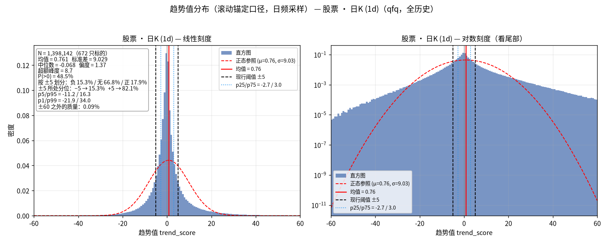
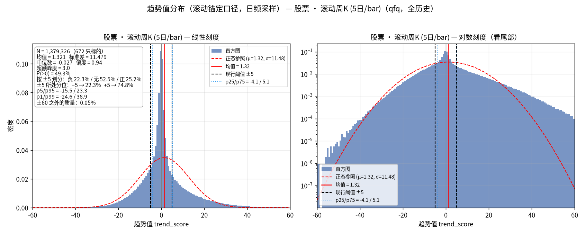
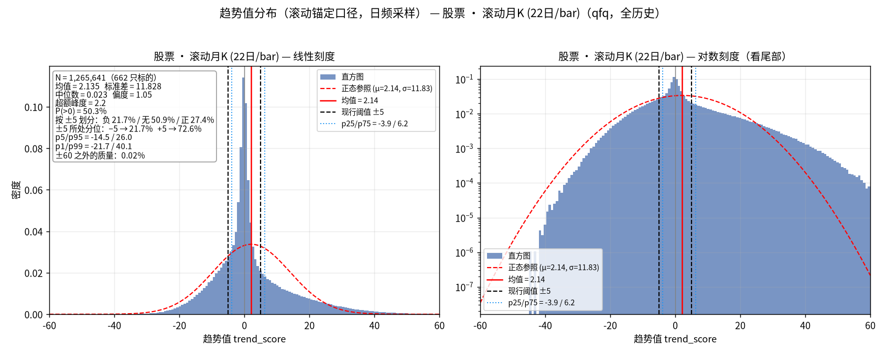
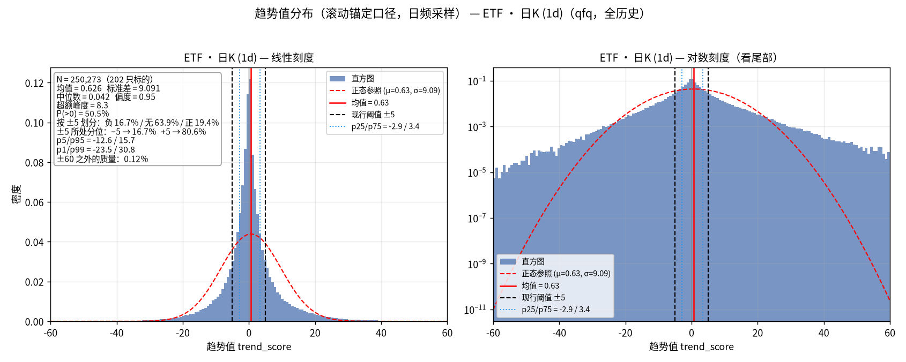
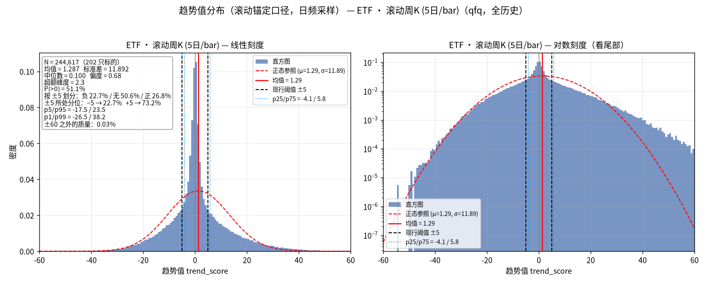
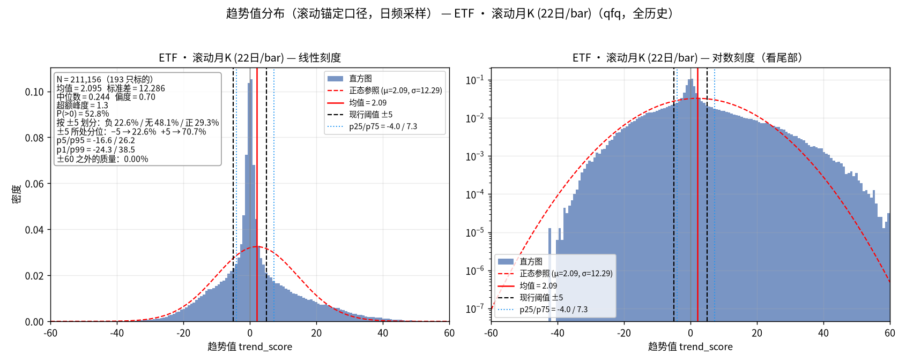
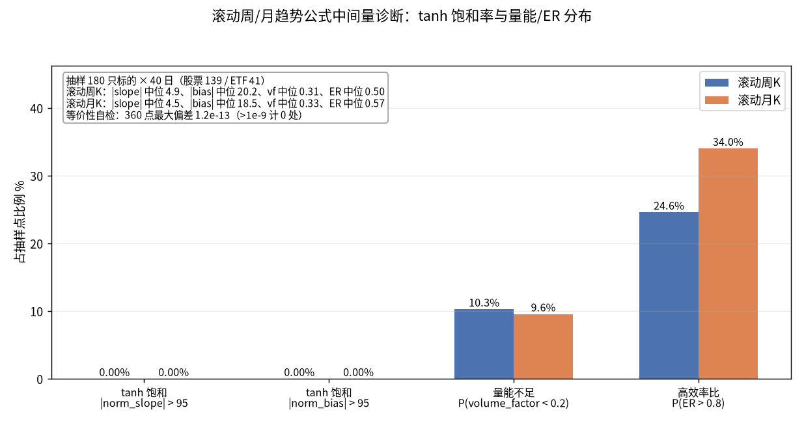
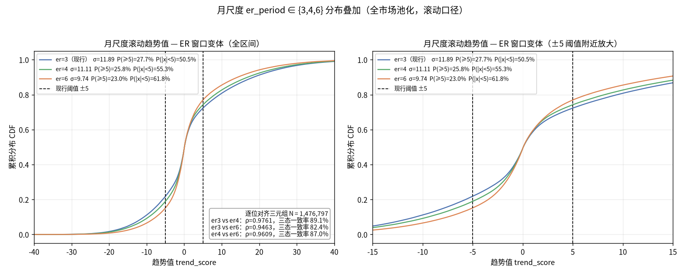

# 滚动锚定周/月趋势值标定：分布、tanh 饱和率与月 ER 窗口

> 日期：2026-09-13
> 状态：已完成（数据、图、脚本均在本目录，可复现）
> 前置研究：`research/2026-09-12_trend-score-distribution/`（vendor 周/月K 六组分布）、
> `research/2026-09-13_phase-migration-live-synth/`（在途合成 bar 的逐日口径）
> 关联模块：`src/core/rolling_bars.py`（滚动锚定周/月K 与趋势值，本研究的标定对象）

## 1. 研究背景

趋势值公式（`core/trend.py::calculate_trend_score_series`）的参数按日K 标定：
MA/EMA 3/5/8、ATR20、ER10、vol_ma20。周/月级趋势此前有两条路径，各有口径问题：

1. **vendor 周期K**（前序分布研究）：每周期一根 bar，只有已收盘周期——
   回测/实盘在周期内看不到当周/当月状态，且窗口参数直接沿用了日K 的
   atr20/er10/vol_ma20（在周/月 bar 上对应 100/440 个交易日，换算粗糙）；
2. **在途合成 bar**（phase-migration-live-synth）：逐日可见，但周期内第一根
   bar 的 volume 只有 1 天、TR 也随周期推进爬坡——`volume_factor` 在周期前段
   系统性压低 confidence，月初/周初的周/月状态天然偏向「无」（该研究 §3 的
   实测：月分量状态变化 33% 堆在月末）。

`core/rolling_bars` 提出的**滚动锚定口径**同时解决这两个问题：第 k 根 bar
（k=0 为最新）= 截至当日的倒数第 k 个 D 交易日窗口（周 D=5、月 D=22），
每根 bar 恒为满 D 个交易日——量能/TR 无周期内爬坡，相邻 bar 间距恒为一个
周期，且整条序列每天重新锚定、严格 PIT。

本研究对滚动口径做全市场标定，回答三个问题：

- 滚动周/月趋势值的**分布**长什么样，现行 ±5 阈值在新分布下卡在哪；
- 公式中间量在周/月尺度是否有 **tanh 饱和**（norm_slope/norm_bias 顶到 ±100
  会让分布削顶）或**量能阻尼**残留；
- 月尺度 **er_period** 取 3/4/6 的差别有多大，现行 3 是否该保留。

## 2. 口径定义

### 2.1 滚动 bar 构造

对交易日 t：第 k 根 bar = 日K 窗口 [t − D·(k+1) + 1, t − D·k] 的聚合
（open=窗口首日 open、high/low=窗口极值、close=窗口末日 close、volume=窗口和），
k = 0..K−1，K=16。t 日的滚动周/月趋势值 = 把该截断 bar 序列喂给
`calculate_trend_score_series` 的末行输出；实现 `rolling_period_trend_series`
为 (T, K) 矩阵向量化，与逐点截断喂入**逐点数学等价**——本研究在生产数据上
复检：360 个抽样点最大绝对偏差 1.2e-13，零不一致（`data/saturation.json`
的 `self_check`）。

### 2.2 参数表

| 参数 | 日K（基准） | 滚动周 (D=5) | 滚动月 (D=22) |
|---|---|---|---|
| MA/EMA n | 3/5/8 | 3/5/8（不动） | 3/5/8（不动） |
| atr_period | 20 | **8**（=40 交易日） | **6**（=132 交易日） |
| vol_ma_period | 20 | **8** | **6** |
| er_period | 10 | **4**（=20 交易日） | **3**（=66 交易日） |
| 预热（min_bars = max(n_long, atr)+2 根 bar） | 22 日 | 50 交易日 | 220 交易日 |

参数来自 `rolling_bars.py::ROLLING_TREND_OVERRIDES` 的设计（模块 docstring；
仓库内无更细的推导文档）。可观察的结构规律：**三个周期都保持 er = atr/2**；
atr 根数 20/8/6 对应日历跨度 20/40/132 个交易日——周期越粗，归一化窗口覆盖
的日历越长（月线约半年），符合「粗周期看更长趋势」的语义；同时 atr 根数
压到 ≤ n_long=8，把预热长度控制在可接受范围（月 220 个交易日 ≈ 一年）。
月 er_period 取 3 是否最优，正是本研究 §4.3 的实验对象。

### 2.3 与前序研究的两点不可比（重要）

- **采样频率**：滚动周/月是**日频采样**（每个交易日一个值），N 与日K 同量级；
  前序 vendor 周/月K 每周期一根（旧 stock_monthly N=11 万 vs 本研究 127 万）。
  两组 N 不可直接比较，相邻样本的自相关也高得多（相邻日共享 D−1 天数据）。
- **窗口参数**：前序周/月K 沿用日K 的 atr20/er10/vol_ma20；本研究用
  §2.2 的折算参数。分布宽度差异同时来自口径与参数，不是单一因素。

## 3. 数据

- 标的池：`instrument_metadata` 的 stock+etf 全部标的（672 股票 + 202 ETF），
  不按 enabled 过滤；数据为生产库 qfq 日K（只读），止于 2026-09-11；
- 每标的保存日频三元组 `(dates, d, w, m)` 于 `data/series/{symbol}.npz`
  （预热期 NaN 保留），六组池化样本于 `data/{asset}_{period}.npy`；
- 覆盖区间（首个/末个有效趋势值）：股票·日 1993-08-26 起，股票·周 1993-10-06 起，
  股票·月 1994-06-13 起；ETF 2005-03-24（日）/2005-05-10（周）/2006-01-12（月）起，
  统一止于 2026-09-11。

## 4. 结果

### 4.1 六组分布（股票/ETF × 日/滚动周/滚动月）

| 组 | N | 标的 | 均值 | 标准差 | 中位数 | 偏度 | 超额峰度 | 按 ±5：负/无/正 | ±5 分位 q(−5)/q(+5) |
|---|---|---|---|---|---|---|---|---|---|
| 股票·日 | 1,398,142 | 672 | 0.76 | 9.03 | -0.07 | 1.37 | 8.7 | 15.3% / 66.8% / 17.9% | 15.3% / 82.1% |
| 股票·滚动周 | 1,379,326 | 672 | 1.32 | 11.48 | -0.03 | 0.94 | 3.0 | 22.3% / **52.5%** / 25.2% | 22.3% / 74.8% |
| 股票·滚动月 | 1,265,641 | 662 | 2.14 | 11.83 | 0.02 | 1.05 | 2.2 | 21.7% / **50.9%** / 27.4% | 21.7% / 72.6% |
| ETF·日 | 250,273 | 202 | 0.63 | 9.09 | 0.04 | 0.95 | 8.3 | 16.7% / 63.9% / 19.4% | 16.7% / 80.6% |
| ETF·滚动周 | 244,617 | 202 | 1.29 | 11.89 | 0.10 | 0.68 | 2.3 | 22.7% / **50.6%** / 26.8% | 22.7% / 73.2% |
| ETF·滚动月 | 211,156 | 193 | 2.10 | 12.29 | 0.24 | 0.70 | 1.3 | 22.6% / **48.1%** / 29.3% | 22.6% / 70.7% |

合理性交叉验证：股票·日组与前序研究逐数字一致（N、均值、std 全同），
管线正确；六组均值均为小的正数，日K 两组 pct_abs_lt_5 落在 0.64~0.67。

**滚动周/月分布明显比日K 宽**（σ 11.5~12.3 vs 9.0~9.1），「无趋势」占比从
日K 的 ~2/3 降到 ~1/2；峰度也从 8+ 降到 1~3（厚尾尖峰减弱——滚动 bar 本身
是 5/22 天的聚合，单 bar 噪声被摊薄）。±5 在滚动分布里卡的分位：日K 上
−5≈p15、p16 / +5≈p81、p82，滚动周/月上 −5≈p22、p23 / +5≈p71~p75。

六张分布图（线性 + 对数双面板，黑虚线为 ±5，蓝点线为 p25/p75）：













### 4.2 中间量诊断：无 tanh 饱和、无量能爬坡残留

抽样 180 只有数据标的（股票 139 / ETF 41）× 每只 40 个均匀采样日
（seed=20260913，采样日取自滚动月序列有效区间），共 7,200 点 × 周/月，
用 `rolling_period_frame` + canonical 公式取中间量：

| 指标 | 滚动周 | 滚动月 |
|---|---|---|
| \|norm_slope\| > 95 | **0.00%** | **0.00%** |
| \|norm_bias\| > 95 | **0.00%** | **0.00%** |
| \|norm_slope\| 中位 | 4.9 | 4.5 |
| \|norm_bias\| 中位 | 20.2 | 18.5 |
| volume_factor 中位 / P(<0.2) | 0.31 / 10.3% | 0.33 / 9.6% |
| ER 中位 / P(>0.8) | 0.50 / 24.6% | 0.57 / 34.0% |



- **tanh 两个非线性臂在周/月尺度完全不饱和**：7,200 点里没有一个 |norm| 过 95，
  price_direction 基本处于 tanh 的近似线性区，分布两端没有削顶 artifact；
- **量能阻尼消失**：满 D 天 bar 的 vol_ratio 围绕 1 平稳波动，vf 中位
  0.31~0.33（≈ vol_ratio=1 时的 1/3），P(vf<0.2) 只有 ~10%——对照在途合成
  口径「周期前段 vf 系统性趋 0」，滚动口径下量能项不再有时间上的结构性偏置；
- **ER 是最有区分度的中间量**：中位 0.50/0.57，且 25%/34% 的点 ER>0.8，
  跨度大——confidence 的截面变化主要来自 ER。

### 4.3 月尺度 er_period ∈ {3, 4, 6} 对比

三版全市场重算（池化 N 均为 1,476,797；逐位对齐三元组同样本量）：

| 变体 | σ | IQR [p25, p75] | P(≥5) | P(\|x\|<5) | 偏度 |
|---|---|---|---|---|---|
| er=3（现行） | 11.89 | [-3.90, 6.38] | 27.7% | 50.5% | 1.00 |
| er=4 | 11.11 | [-3.03, 5.37] | 25.8% | 55.3% | 1.11 |
| er=6 | 9.74 | [-2.42, 4.26] | 23.0% | 61.8% | 1.29 |

| 配对 | Pearson ρ | ±5 三态一致率 |
|---|---|---|
| er3 vs er4 | 0.976 | 89.1% |
| er3 vs er6 | 0.946 | 82.4% |
| er4 vs er6 | 0.961 | 87.0% |



窗口越长，ER 估计越平滑（噪声被平均），confidence 越集中在低值区，分布
越窄、越多质量落回「无」；但三版的相关与状态一致率都很高——**月 ER 窗口
是个低敏感参数**。

### 4.4 spot check（无跳变验证）

510300.SS：日期严格递增；d/w/m 三条序列首个有效值之后均无 NaN 空洞；
相邻日最大 |Δ|：日 77.6（2024-10-09，924 行情后国庆回调日）、
周 31.3（2020-02-03，疫情开市 −8% 日）、月 17.5（2015-01-19，"119" 股灾日）
——最大变动全部落在真实极端行情日，且周期越粗单日变动越小（日 77.6 →
周 31.3 → 月 17.5），滚动序列平滑性符合预期，无口径 artifact。

## 5. 结果分析

1. **滚动口径把周/月趋势值从「稀疏、滞后」变成「日频、即时」的代价是
   分布变宽、无趋势区缩小。** 机制上有两个来源：(a) 消除了量能阻尼——
   在途合成口径周期前段 confidence 被 vf 压向 0，滚动口径没有这段「人为
   无趋势」；(b) 窗口参数折算后响应更快（周 atr8/er4 vs 旧沿用的 atr20/er10）。
   方向上与 phase-migration-live-synth 的观察自洽（该研究在仍有阻尼的
   口径下「无无无」已占 48.4%）。
2. **±5 阈值在滚动周/月上偏窄了。** 日K 上 ±5 卡在 ~p15/~p82，把 ~2/3
   样本划为「无趋势」，与前序研究的先验吻合；滚动周/月上 ±5 卡在
   ~p22/~p73，「无趋势」只剩 ~1/2——同样叫「趋势启动」，滚动周/月尺度
   触发频率明显更高。右偏结构（正趋势多于负趋势）在各组保持，与日K 一致。
3. **公式在周/月尺度的行为是健康的**：无饱和削顶（§4.2），无量能时间
   偏置，ER 提供主要区分度；滚动月比滚动周更平滑（spot check 最大单日
   |Δ| 17.5 vs 31.3），适合作为慢变量。
4. **月 ER 窗口不敏感**（ρ≥0.95、一致率 ≥82%）：er 3→6 的实质效果是把
   分布压窄约 18%（σ 11.9→9.7）、把「无趋势」从 50% 抬到 62%，相当于
   一个温和的保守化旋钮，而不是质性改变。

## 6. 结论与建议

1. **±5 阈值**：日K 维持 ±5（本研究复现了前序结论：~2/3 无趋势、p15/p82）。
   滚动周/月上是否维持 ±5 取决于下游语义：
   - 若要求「无趋势为多数」与日K 语义对齐：±5 偏窄，建议放宽到 **±9**
     （实测恢复 2/3 无趋势所需的对称阈值：股票周 8.3 / 股票月 8.9 /
     ETF 周 9.1 / ETF 月 10.1）；按日K 相同分位（p15.3/p82.1）折算
     为股票周 [-7.9, +9.0]、股票月 [-7.6, +10.8]，同量级、略右偏；
   - 若下游只是相对比较强弱/做排序，±5 仍可用，但要有防抖（相位判定
     建议在滚动口径下配合趋势值 MA5 或连续 N 日确认——滚动序列日频
     采样，单日穿越比 vendor 周期K 频繁得多）。
2. **月 er_period 建议维持 3**。三变体高度共线，改 4/6 只换来分布收窄、
   信号变少，没有结构性收益；er=3 保持 er = atr/2 的三周期一致结构，
   且月尺度本就负责「看更长的趋势」，更宽的分布给慢变量更多状态区分度。
   若未来实证发现月级信号噪声过大，er=4（与 er3 一致率 89%）是可接受
   的保守化折中，不建议直接跳到 6。
3. **量能项在周/月尺度的边际贡献小，但建议保留**。滚动 bar 恒满 D 天后，
   vf 围绕 1/3 平稳波动（中位 0.31~0.33 → vf^0.3 ≈ 0.70，近似常数缩放），
   只有 ~10% 的点 vf<0.2；confidence 的区分度几乎全由 ER 承担。量能项
   在滚动口径下既不是偏置源也不是主要信息源——保留它的价值在于
   停牌/长期缩量等异常场景的温和降级（vf→0 时 confidence→0），
   成本几乎为零；若未来要精简周/月公式，它是第一个候选剔除项。
4. **对下游研究的口径提示**：引用滚动周/月分布数字时，注意 N 是日频
   采样（与 vendor 周期K 的 N 不可比），且相邻样本自相关强，有效样本量
   远小于名义 N；相位迁移类研究若切换到滚动口径，事件频次会显著上升，
   ±5 阈值选择（§6.1）需要先定下来再跑。

## 7. 局限

- 池化分布混合横截面与时间维度；滚动口径相邻日共享 D−1 天数据，自相关
  比日K 更强，有效样本量 << 名义 N（分布形状可信，尾部精确比例不宜过度解读）；
- 全历史口径，未按牛/熊/震荡年代分层；存在幸存者偏差；ETF 池历史短
  （月组 193 只 / 21 万点，置信度低于股票组）；
- 中间量诊断基于 180×40 抽样（seed 固定，可复现），非全市场逐点；
  采样日取自月序列有效区间，预热段（上市首 ~220 交易日）不覆盖；
- d/w/m 三条序列同源自同一日K，三组分布不独立；
- 滚动周/月序列由 qfq 日K 聚合，除权日附近与 vendor 已收盘周期K 存在
  微小口径缝（周月K方案 §8.3）；趋势值全是比值，对该平移不变。

## 8. 复现

```bash
# 1) 计算（生产 venv，只读生产库；DB 文件属主 trendquant；全市场约 5 分钟）
sudo -u trendquant .venv/bin/python research/2026-09-13_rolling-trend-calibration/compute_calibration.py

# 2) 绘图（隔离 plot-venv，仅依赖 matplotlib）
sudo -u trendquant scripts/temp/plot-venv/bin/python research/2026-09-13_rolling-trend-calibration/plot_calibration.py
```

计算脚本内置两项自检并打印：滚动序列 vs 截断喂入 canonical 公式的等价性
（360 点，写入 `data/saturation.json` 的 `self_check`）；单标的序列连续性
spot check（日期递增、无 NaN 空洞、相邻日最大 |Δ|）。§6.1 的阈值换算由
`data/*.npy` 一行 `np.quantile` 复算（样本可再生，故不入库）。

**git 管理口径**（`research/.gitignore` 已补 `*/data/series/`）：`data/*.npy`
池化样本、`data/series/*.npz` 逐标的序列（合计 ~90MB）与 `fonts/` 为可再生
产物，不入库；`data/stats.json` / `data/saturation.json` / `data/er_variants.json`
（报告引用的权威数字）与 8 张 png 随库管理。

## 9. 目录内容

| 文件 | 说明 | 入库 |
|---|---|---|
| `compute_calibration.py` | 标定计算脚本（生产 venv，`sudo -u trendquant` 运行） | ✓ |
| `plot_calibration.py` | 绘图脚本（隔离 plot-venv） | ✓ |
| `data/stats.json` | 六组描述性统计 + ±5 分位 + 覆盖区间 | ✓ |
| `data/saturation.json` | 中间量抽样诊断 + 等价性自检结果 | ✓ |
| `data/er_variants.json` | 月 er∈{3,4,6} 分布/相关/一致率 | ✓ |
| `dist_*.png` | 六组分布图（本报告插图） | ✓ |
| `diag_saturation.png` / `diag_er_variants.png` | 诊断图 | ✓ |
| `data/{stock,etf}_{daily,weekly,monthly}.npy` | 六组池化样本（可再生） | ✗ gitignore |
| `data/er_variant_monthly_er{4,6}.npy` | ER 变体池化样本（可再生） | ✗ gitignore |
| `data/series/{symbol}.npz` | 逐标的 (dates, d, w, m) 日频序列（可再生） | ✗ gitignore |
| `fonts/NotoSansCJKsc-Regular.otf` | 绘图中文字体（OFL；从邻近研究目录复制） | ✗ gitignore |
