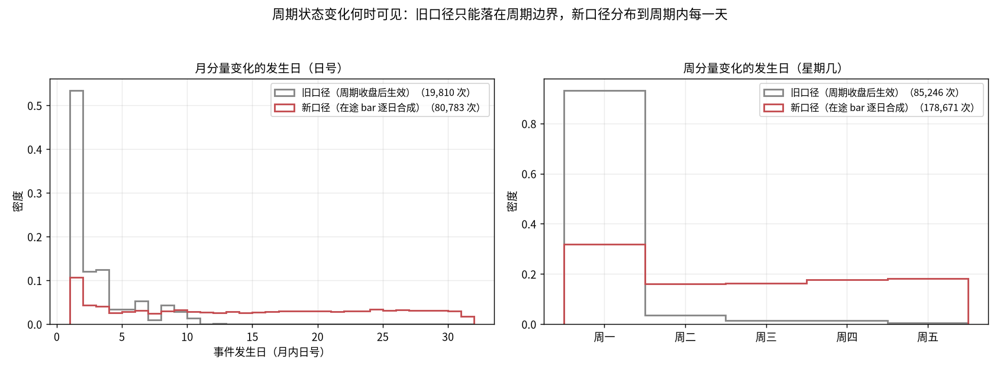
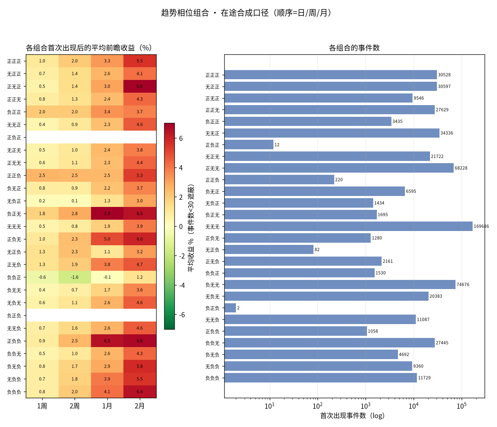
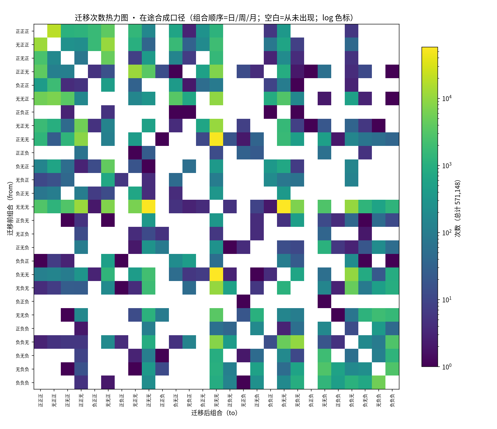
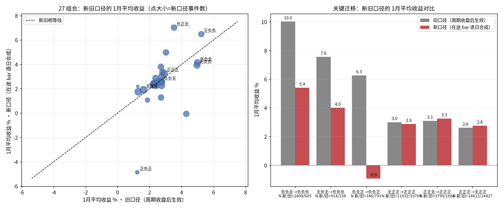
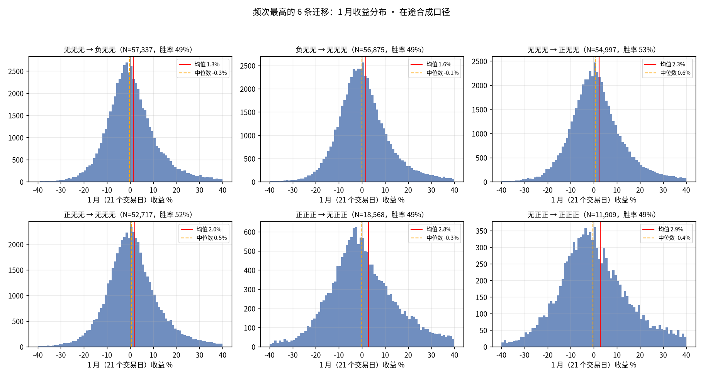
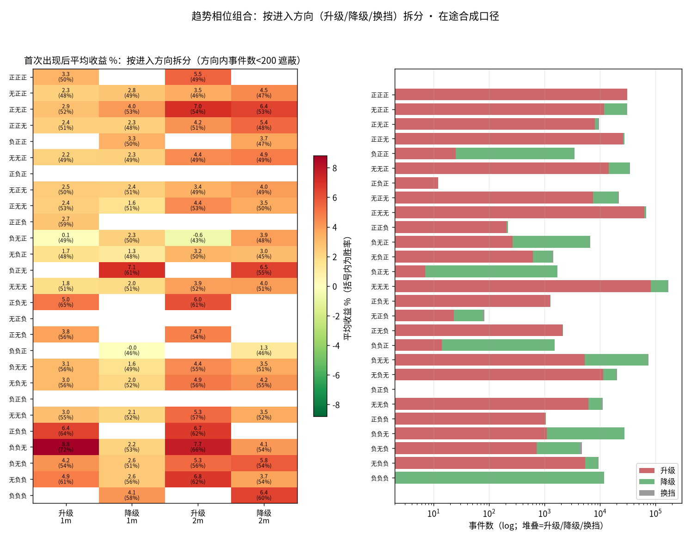

# 趋势相位迁移（在途合成版）：周/月趋势逐日实时计算的 27 组合研究

> 日期：2026-09-13
> 状态：已完成（数据、图、脚本均在本目录，可复现）
> 前置研究：`research/2026-09-13_趋势相位迁移/`（边界生效口径，本研究是它的口径修正与对比）

## 1. 研究背景

旧版研究里，周/月级趋势状态要到**周期收盘后的第一个交易日**才生效：
8 月月K 的趋势即使到 8 月中旬已经实际转正，也要等到 9 月 1 日才记为
「首次转正」并从 9 月 1 日起算收益。需求方指出这会带来系统性偏差：
**8 月中后段的上涨完全没被统计到，9 月 1 日入场时行情已经走过一段，
旧版观察到的「反转效应」可能部分是「迟到入场」的假象。**

本研究把周/月趋势改为**逐日实时计算**——每一天收盘后，把当周/当月
**在途 bar** 用日K 合成出来，与已收盘周期序列拼接后计算该级趋势值，
使「首次转正」这类事件能够落在周期内的任意一天，与实盘每天真实可见的
信息完全一致。其余口径（±5 阈值、27 组合、事件定义、收益窗口）与旧版
**逐项相同**，以保证两版结果可直接对比。

## 2. 研究方法

### 2.1 在途 bar 合成与逐日趋势值

- 已收盘周/月 bar：沿用 vendor 周期表（`market_data_qfq_weekly/monthly`）；
- 在途 bar：用日K 在周期内累计合成——open=周期首日 open、high/low=周期内
  累计极值、close=当日收盘、volume=周期内累计成交量；
- 每日的趋势值 = 「已收盘序列 + 在途 bar」末根的趋势值。实现上用增量算法
  （EMA/ATR/MA/ER/vol_ma 的历史状态对已收盘序列只算一次，在途 bar O(1) 推出），
  **与生产函数 `calculate_trend_score_series` 逐点数学等价**——内置自检：
  随机抽样 240 个（标的 × 日）点，把拼接序列喂给生产函数比对，
  最大绝对差 **2e-12**（浮点噪声级），有效/无效判定零不一致。

### 2.2 与旧版逐项一致的口径

趋势值实现与 strategy 配置同源；>5 正 / <-5 负 / 中间无；组合 (日,周,月)
在相邻有效交易日间变化记一次事件；前瞻收益 = 事件日收盘 → 5/10/21/42 个
交易日收盘（≈1周/2周/1月/2月），末尾窗口不足分别剔除；标的池为
`instrument_metadata` 的 stock+etf。

### 2.3 样本

- **571,148 次**迁移事件（旧版 496,988，+15%）、831 只标的、380 条不同
  迁移路径；事件日期 1995-04-10 ~ 2026-09-11；
- 周/月状态现在每天可变，月分量变化事件从旧版 19,810 次增至 **80,783 次**，
  周分量变化从 85,246 次增至 **178,671 次**。

## 3. 周期状态变化何时可见：旧口径集中边界，新口径分布全周期



- 旧口径的月分量变化 85% 落在每月 1~5 日（边界效应的直证）；新口径下
  1~5 日只占 25%，**21 日及以后占 33%**——月级状态变化最多发生在月末，
  因为月初的在途 bar 量能不足，`volume_factor` 把 confidence（进而趋势值）
  系统性压低，月初状态天然偏向「无」，趋势值要积累到周期后段才有足够
  「确认度」越过 ±5。周分量同理（旧口径 94% 在周一；新口径分布到全周）。
- 结构后果：新口径下「无无无」占全部有效交易日的 **48.4%**（旧 34.7%），
  「正正正」5.3%（旧 2.9%）、「负负负」1.8%（旧 1.0%）。

## 4. 结果

### 4.1 27 组合首次出现后收益（新口径）



与旧版对照（1月=21 交易日均值 / 胜率）：

| 组合 | 事件数 新/旧 | 1月均值 新 | 1月均值 旧 | 1月胜率 新 | 1月胜率 旧 |
|---|---|---|---|---|---|
| 正正正 | 30,528 / 16,344 | +3.26% | +2.91% | 50.2% | 49.5% |
| 负负负 | 11,729 / 5,741 | +4.14% | +4.99% | 58.3% | 60.3% |
| 无负负 | 9,360 / 10,062 | +3.93% | +4.96% | 58.9% | 60.6% |
| 正负负 | 1,058 / 4,023 | +6.48% | +5.23% | 64.5% | 62.2% |
| 负正无 | 1,695 / 8,204 | +7.01% | +3.53% | 61.6% | 52.6% |
| 无无无 | 169,686 / 113,911 | +1.91% | +1.62% | 50.8% | 50.0% |

新口径四窗口全览（代表组合；均值 / 胜率）：

| 组合 | 1周（5日） | 2周（10日） | 1月（21日） | 2月（42日） |
|---|---|---|---|---|
| 正正正 | +1.00% / 49% | +2.00% / 50% | +3.26% / 50% | +5.55% / 49% |
| 负负负 | +0.76% / 52% | +1.98% / 54% | +4.14% / 58% | +6.43% / 60% |
| 无负负 | +0.73% / 52% | +1.78% / 55% | +3.93% / 59% | +5.52% / 59% |
| 正负负 | +0.86% / 53% | +2.50% / 57% | +6.48% / 64% | +6.75% / 62% |
| 负正无 | +1.77% / 58% | +2.82% / 60% | +7.01% / 62% | +6.46% / 55% |
| 无无无 | +0.46% / 50% | +0.84% / 50% | +1.91% / 51% | +3.92% / 51% |

（完整 27 行 × 四窗口全套统计见 `data/combo_stats.csv`；窗口越短区分度越低，
但方向一致，例如 负正无 从 1周 起就显著偏强）

**反转梯度在新口径下依然存在但被压缩**：负负负（+4.14%/58.3%）仍优于
正正正（+3.26%/50.2%），但差距从旧版的 2.1pp/10.8pp 收窄到 0.9pp/8.1pp。

### 4.2 迁移频次矩阵（新口径）



- 负负负→正正正 与 正正正→负负负 在新口径下仍是 **0 次**（三级同日翻转
  即使在逐日口径下也没发生过）；
- 频次榜首仍是日级翻转（无无无⇄正/负无无，5~6 万次量级）；
- 新出现的常见路径：无无无→正正无（11,209 次）、无正正→无无正（10,834 次）
  ——周/月分量在周期内变化产生的迁移，旧口径里它们只能发生在边界。

### 4.3 新旧口径直接对比



**关键迁移的 1月平均收益（新 vs 旧）**：

| 迁移 | N 新/旧 | 新口径 | 旧口径 | 变化 |
|---|---|---|---|---|
| 负负无→负负负 | 2,808 / 605 | +5.40% / 胜率61% | +10.02% / 77% | 腰斩但仍强 |
| 无负无→负负负 | 914 / 138 | +4.00% / 60% | +7.55% / 69% | 明显回落 |
| 负无正→负负正 | 346 / 793 | **-0.92% / 43%** | +6.26% / 64% | **由正转负** |
| 无正正→正正正 | 11,932 / 10,769 | +2.87% / 49% | +3.00% / 50% | 基本不变 |
| 正正无→正正正 | 3,799 / 1,066 | +3.3% | +3.1% | 基本不变 |
| 正正正→无正正 | 18,612 / 14,427 | +2.75% / 49% | +2.61% / 49% | 基本不变 |

**需求方的判断被验证**：旧版最惊艳的两条「抄底」路径收益腰斩起步，
其中 负无正→负负正 直接由 +6.3% 转为 **-0.9%**——旧口径的可观收益
相当部分来自「信号确认时行情已走完一段」，而非真实的预测力。
**动量类迁移（右侧三条）两种口径下几乎一致**——它们本来就在周期后段
形成，口径修正对它们没有实质影响。

### 4.4 「月趋势首次转正」的提前量与收益差

把新旧两版的「月分量转负/无 → 正」事件按（标的，周期月份）配对
（新口径取该月内**第一次**转正），共匹配 4,809 对（匹配率 79%）：

- 新口径**平均提前 6.4 天**（中位 6 天）；提前 ≥5 天占 53%，≥10 天占 43%；
- 同一批事件的收益对比（新事件日入场 vs 旧事件日入场）：

| 入场口径 | 1周均值/胜率 | 1月均值/胜率 | 2月均值/胜率 |
|---|---|---|---|
| 新（月内首次转正日） | +2.00% / 56.8% | +5.43% / 57.7% | +9.54% / 57.6% |
| 旧（次月首个交易日） | +1.19% / 51.7% | +4.37% / 55.3% | +6.47% / 50.8% |

即「更快看到同一个信号」本身就有价值：2月窗口多赚约 3pp、胜率提高约 7pp。

### 4.5 头部迁移的收益分布（新口径）



与旧版形态一致：接近对称钟形、σ≈9~10%，高频迁移胜率 48~52%——
单条高频迁移的区分度依旧有限，信息仍在低频的极端组合上。

### 4.6 按进入方向拆分：升级 / 降级 / 换挡

组合层面的数字把「从哪个方向进入该组合」混在了一起：首次出现 正正无，
可以是 无无无→正正无（周级转多，**升级**），也可以是 正正正→正正无
（月级降温，**降级**）——行情含义相反，不应混读。本节按方向拆分：
状态值 正=+1/无=0/负=-1，`delta = sum(to) − sum(from)`，>0 升级 /
<0 降级 / =0 换挡（一级升一级降，如 正无无→无正无）。
全部事件中 升级 279,641 / 降级 283,437 / 换挡 8,070 次。



拆分差异最大的组合（1月均值/胜率，升级 vs 降级）：

| 组合 | 升级进入 | 降级进入 | 差值 |
|---|---|---|---|
| 负负无 | **+8.81% / 72%**（N=1,102） | +2.23% / 53%（N=26,108） | +6.6pp |
| 无负负 | +4.87% / 61%（N=5,426） | +2.60% / 56%（N=3,721） | +2.3pp |
| 负无负 | +4.22% / 54%（N=711） | +2.58% / 51%（N=3,573） | +1.6pp |
| 负无无 | +3.06% / 56%（N=5,231） | +1.62% / 49%（N=68,098） | +1.4pp |
| 负无正 | +0.09% / 49%（N=265） | +2.32% / 50%（N=6,274） | −2.2pp |

两个直接回答开头问题的例子：

- **正正无**：升级进入 +2.40%/51%（N=26,135，主要来自 无无无/正无无/无正无
  的周级转多）vs 降级进入 +2.34%/47%（N=1,191，全部来自 正正正 降温）
  ——均值接近但胜率与结构不同，降级进入更弱；
- **负负无**：升级进入（几乎全是 负负负→负负无，三空开始修复）是全表中
  最强的信号之一；降级进入（无负无→负负无，恶化途中）则平庸——
  组合层面的 +2.55%/54%（§4.1）完全是两种行情的加权平均。

（27 组合 × 3 方向 × 4 窗口全套统计见 `data/combo_dir_stats.csv`；
方向内 N<200 的单元格在图中遮蔽。）

## 5. 结果分析

1. **旧版的反转效应「有真成分，也有口径成分」**。以旗舰路径 负负无→负负负
   为例：+10.0%/77% 是滞后口径下的读数，修正到实时口径后为 +5.4%/61%。
   绝对水平腰斩，但仍显著优于无信息基线（无无无 的 +1.9%/51%）——
   超跌反弹是真实现象，只是没旧版显示的那么肥。
2. **有些旧版「明星路径」是口径幻象**。无负正→无负负（旧 +13.8%）与
   正负正→正正正（旧 -3.16%）在新口径下**零发生**：旧口径允许月级状态在
   边界从「正」直接跳到「负」（跳变路径），而实时口径下月级状态只能随
   在途 bar 逐日渐变，必先经过「无」。这些路径的惊艳数字本质是滞后边界
   制造出来的稀有样本。
3. **新口径的代价要清楚**：(a) 信号噪声化——月趋势转正平均每个
   （标的，月）出现 **1.5 次**（在 ±5 附近反复穿越），若按信号交易需考虑
   防抖（如要求连续 N 日站稳、或结合趋势值 MA5）；(b) 周期前段的量能阻尼
   ——月/周初的趋势值被 `volume_factor` 系统性压向「无」，周期前半段的
   周/月级状态信息量低，这是公式本身的行为而非数据问题。
4. **对预测用法的建议**：迁移表仍应作为**条件先验**使用，但请优先采用
   本目录的新口径数字——它们与实盘每天可见的信息对齐；旧口径（边界生效）
   的数字系统性高估了慢速信号的入场优势。
5. 两版研究的互补关系：旧版回答「周期确认后跟随」的表现（偏保守、信号少），
   本版回答「逐日实时跟踪」的表现（更快、更噪、更真实）。策略落地时建议
   在新口径信号上加防抖，并用回测验证 负负无→负负负（+5.4%/61%）、
   负正无（+7.0%/62%）、正负负（+6.5%/65%）这几条仍然健在的路径。
6. **用方向拆分后的条件先验会更准**（§4.6）：组合层面的均值是「升级进入」
   与「降级进入」的加权平均，两个方向的收益可差 2~7pp。择时/预测引用
   本研究的数字时，应按实际发生的迁移方向取 `combo_dir_stats.csv` 的拆分值，
   而不是组合层面的混合值——典型如 负负无：只有「三空开始修复」
   （升级进入）才是强信号，「恶化途中」（降级进入）并不构成买入依据。

## 6. 局限

- 继承旧版的全部局限：截面相关（有效样本 << 名义 N）、幸存者偏差、
  未按年代分层、未计成本、窗口重叠；
- 在途 bar 由 qfq 日K 聚合，与 vendor 已收盘 qfq 周期 bar 在除权日附近
  存在微小口径缝（周月K方案 §8.3 的实证）；对趋势值的影响远小于
  ±5 阈值步长，自检差值已含此因素；
- 月初/周初的量能阻尼使该时段的状态几乎恒为「无」（§3），新口径在周期
  前段的「无趋势」读数不等于「确认无趋势」；
- 匹配分析（§4.4）按（标的，月份）配对，约 21% 的旧版事件在新口径下
  当月没有对应的「月中转正」记录（月末才转正或月内反复），提前量统计
  基于可匹配子集。

## 7. 复现

```bash
# 1) 计算（生产 venv，只读生产库；含精确性自检，不一致会拒绝落盘）
.venv/bin/python research/2026-09-13_趋势相位迁移_在途合成/trend_phase_live.py

# 2) 绘图（隔离 venv；对比图会读取旧版研究目录的数据）
scripts/temp/plot-venv/bin/python research/2026-09-13_趋势相位迁移_在途合成/plot_phase_live.py
```

git 口径：与既有约定一致——`data/events.csv`（~73MB 明细）与 `fonts/`
不入库可再生；聚合 CSV 与图入库。

## 8. 目录内容

| 文件 | 说明 | 入库 |
|---|---|---|
| `trend_phase_live.py` | 在途合成版事件计算（含精确性自检） | ✓ |
| `plot_phase_live.py` | 绘图脚本（隔离 plot-venv） | ✓ |
| `dir_split.py` | 按进入方向（升级/降级/换挡）拆分组合收益 | ✓ |
| `data/summary.json` | 元信息（模型标识、自检结果） | ✓ |
| `data/combo_stats.csv` | 27 组合聚合（新口径） | ✓ |
| `data/combo_dir_stats.csv` | 27 组合 × 3 方向 × 4 窗口拆分统计 | ✓ |
| `data/transition_stats.csv` | 380 条迁移路径聚合（新口径） | ✓ |
| `data/events.csv` | 571,148 条事件明细（可再生） | ✗ gitignore |
| `heatmap_transition_counts.png` | 迁移次数热力图 | ✓ |
| `combo_returns_heatmap.png` | 27 组合收益 + 频次 | ✓ |
| `combo_dir_split.png` | 27 组合 × 方向拆分收益热力图 | ✓ |
| `dist_top_transitions.png` | 头部 6 条迁移收益分布 | ✓ |
| `timing_shift.png` | 新旧口径的状态可见时机对比 | ✓ |
| `compare_old_new.png` | 27 组合散点 + 关键迁移新旧对比 | ✓ |
| `fonts/` | 绘图中文字体（自动下载） | ✗ gitignore |
