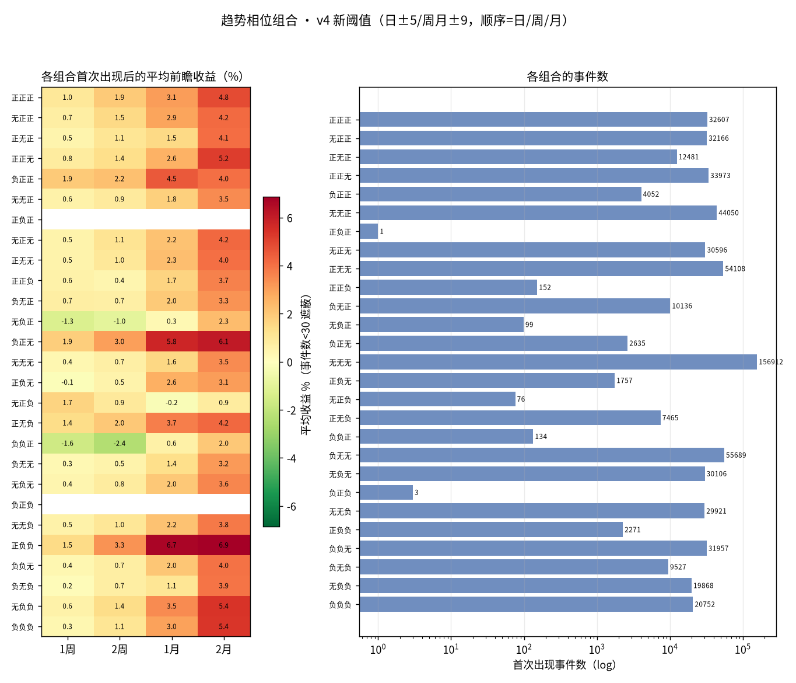
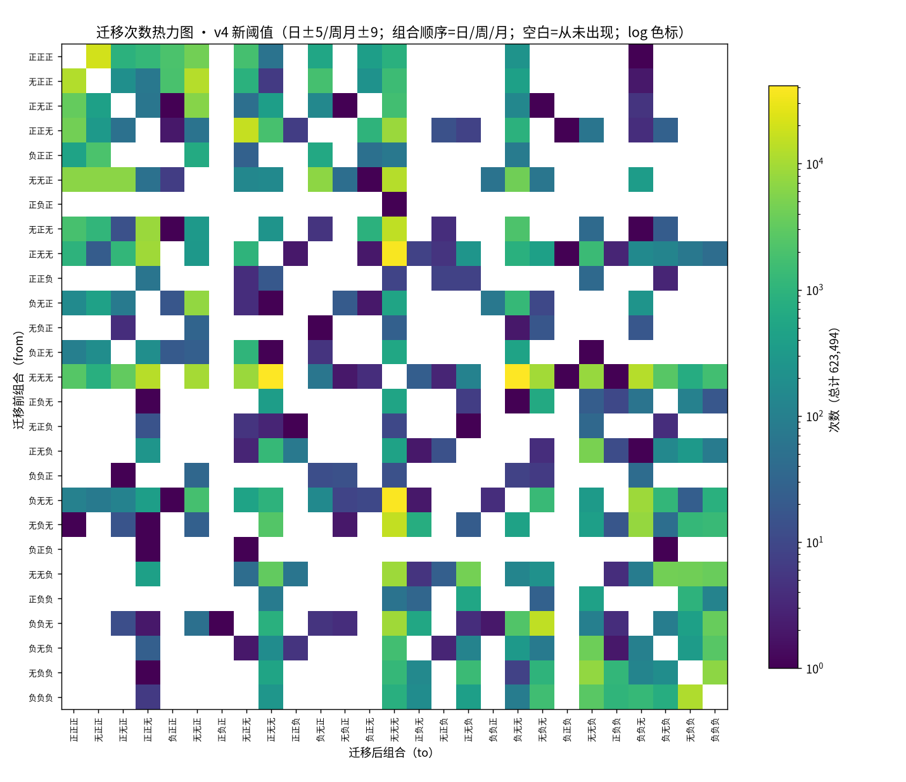
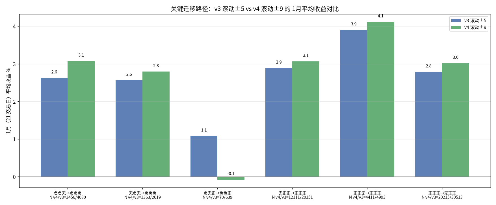
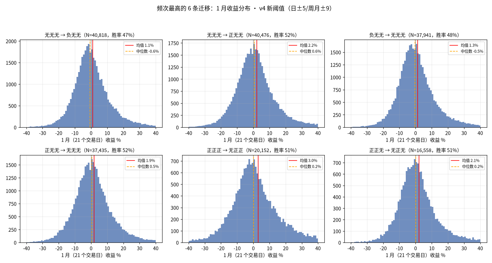
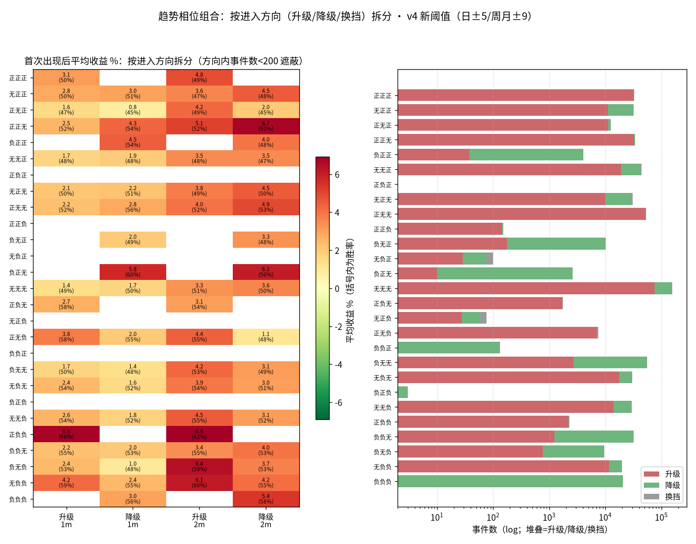
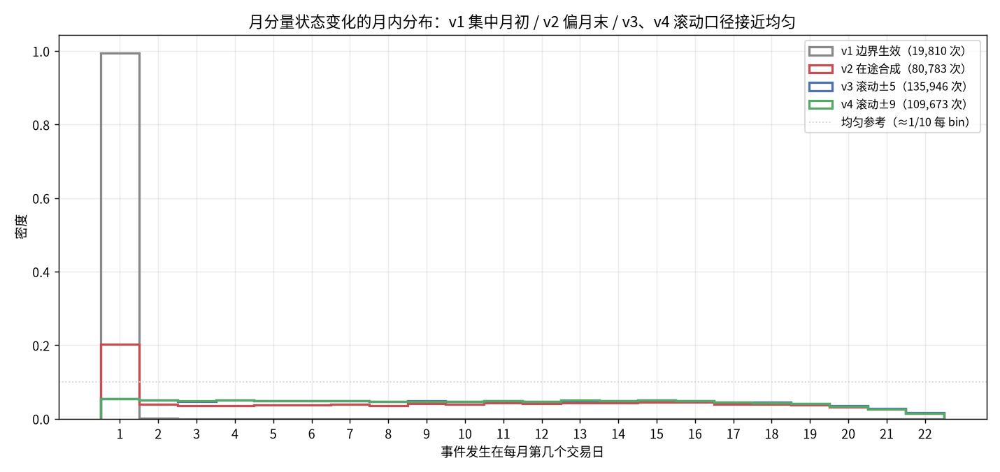

# 趋势相位迁移（新阈值版 v4）：周/月三态阈值 ±5→±9 的 27 组合研究

> 日期：2026-09-14
> 状态：已完成（数据、图、脚本均在本目录，可复现）
> 前置研究：`research/2026-09-13_phase-migration/`（v1，边界生效口径）、
> `research/2026-09-13_phase-migration-live-synth/`（v2，在途合成口径）、
> `research/2026-09-13_phase-migration-rolling/`（v3，滚动锚定口径，三态阈值 ±5）——
> 本研究是同一系列的第四版，事件/收益/统计口径与 v3 逐项一致，
> 唯一差别是**周/月级三态阈值 ±5 → ±9**（日级 ±5 不变）。

## 1. 研究背景

v3 把周/月级状态切换到滚动锚定口径后，月分量变化的月内分布接近期望均匀
（口径问题闭环），但遗留一个阈值问题：滚动周/月趋势值的分布显著宽于日K
（标定研究 `research/2026-09-13_rolling-trend-calibration` 实测 σ≈11.5~12.3，
日K σ≈6~7），沿用 ±5 阈值使周/月级「有趋势」的时间占比远高于日K 语义，
±5 附近的单日穿越产生大量噪声事件——v3 里出现了 1 次 正正正→负负负 与
7 次月分量 正⇄负 跳变（不经过「无」）这类物理上更像抖动的样本。

标定研究 §6 的建议：滚动周/月要恢复日K「约 2/3 时间无趋势」语义，
对称阈值应放宽到 **±9** 附近（实测所需阈值：股票周 8.3 / 股票月 8.9 /
ETF 周 9.1 / ETF 月 10.1）。本版据此把周/月三态阈值定为 ±9，日级维持 ±5
（日K 分布本来就以 ±5 恢复 ~2/3 无趋势，标定研究复核过），重跑全套
27 组合事件/收益/迁移统计，并与 v3(±5) 逐项对比——核心问题是：
**阈值变宽后，v3 的哪些结构是真信号、哪些是阈值噪声？**

## 2. 口径与方法

### 2.1 与 v3 逐项一致的部分

- 周/月 bar：滚动锚定（`core/rolling_bars`），第 k 根 bar = 截至当日倒数
  第 k 个 D 交易日窗口（周 D=5、月 D=22，右闭）；参数 周 atr8/vol_ma8/er4、
  月 atr6/vol_ma6/er3，MA/EMA 3/5/8 与 tanh/权重不动；
- 日级：`calculate_trend_score_series` + DB strategy 默认 cfg 现算；
- 事件定义：组合 (日,周,月) 在相邻有效交易日间变化记一次事件；
- 前瞻收益：事件日收盘 → 其后 5/10/21/42 个交易日收盘（≈1周/2周/1月/2月）；
- 27×27 迁移矩阵；方向拆分（delta = sum(to) − sum(from) → 升级/降级/换挡）
  与 v3 的 `dir_split.py` 完全相同；标的池 = `instrument_metadata` 的
  stock+etf（874 只）；输出 schema 与 v3 一致。

### 2.2 v4 的两处差别

1. **三态阈值**：日级 >5 正 / <−5 负（不变）；周/月级 **>9 正 / <−9 负** /
   其余无（边界 = 含于「无」，脚本内有边界探针自检）。
2. **周/月趋势值数据源**：不再逐只现算，直接读库表 `trend_rolling_daily`
   （symbol, time, w_trend, m_trend；`db.load_rolling_trend_many` 批量读取）。
   该表存的就是滚动锚定口径的全市场全历史序列。

**精确性自检**（不通过则拒绝落盘，本次全部通过）：

- 抽 40 只有数据的标的，把库读 w/m 按日K时间轴对齐后与
  `rolling_period_trend_series` 现算**全序列逐点比对**：max|Δ| = **0.0**
  （严格相等），有效/无效判定零不一致；
- 阈值边界探针：±8.999→无 / ±9→无 / ±9.001→有趋势，确认三态切分
  严格按 日±5 / 周月±9；
- 旁证：v4 日级分量变化次数 442,381、有效标的日 1,476,797，
  与 v3 完全相等——日级腿与样本面逐点重合，差异全部来自周/月阈值。

## 3. 样本

- **623,494 次**迁移事件（v3 676,407，**−7.8%**）、855 只标的（同 v3）、
  **335 条**不同迁移路径（v3 393）；
- 事件日期 1994-06-15 ~ 2026-09-11（同 v3）；有效标的日 1,476,797（同 v3）；
- 分量变化次数：日 442,381（同 v3）/ 周 210,845（v3 261,684，−19.4%）/
  月 **109,673**（v3 135,946，−19.3%）；仅日级变化的事件占 **51.5%**
  （v3 45.8%）——周/月级事件被 ±9 筛掉约两成，事件结构向日级倾斜。

## 4. 结果

### 4.1 27 组合首次出现后收益（v4）



代表组合四窗口（均值 / 胜率）：

| 组合 | 事件数 | 期间占比 | 1周（5日） | 2周（10日） | 1月（21日） | 2月（42日） |
|---|---|---|---|---|---|---|
| 正正正 | 32,607 | 5.5% | +0.97% / 49% | +1.95% / 51% | +3.10% / 50% | +4.85% / 49% |
| 无正正 | 32,166 | 3.9% | +0.74% / 48% | +1.55% / 50% | +2.93% / 51% | +4.16% / 48% |
| 负正正 | 4,052 | 0.3% | +1.94% / 56% | +2.24% / 55% | +4.52% / 54% | +4.04% / 48% |
| 无无无 | 156,912 | 39.4% | +0.37% / 49% | +0.66% / 50% | +1.57% / 50% | +3.46% / 50% |
| 负负无 | 31,957 | 4.2% | +0.37% / 52% | +0.71% / 51% | +2.04% / 53% | +3.97% / 53% |
| 无负负 | 19,868 | 2.4% | +0.56% / 52% | +1.42% / 53% | +3.46% / 57% | +5.38% / 58% |
| 正负负 | 2,271 | 0.2% | +1.47% / 57% | +3.31% / 62% | **+6.66% / 66%** | +6.86% / 62% |
| 负正无 | 2,635 | 0.2% | +1.87% / 57% | +3.03% / 59% | **+5.75% / 60%** | +6.08% / 56% |
| 负负负 | 20,752 | 3.4% | +0.32% / 50% | +1.12% / 51% | +2.97% / 56% | +5.36% / 58% |

（完整 27 行 × 四窗口全套统计见 `data/combo_stats.csv`）

### 4.2 迁移频次矩阵（v4）



- 频次榜首换人了：v3 居首的 正正正→无正正（30,513）降到第五（20,215），
  前四名全部是「无无无 ⇄ 日级单翻」路径（无无无→负无无 41,779 /
  无无无→正无无 41,225 / 负无无→无无无 38,724 / 正无无→无无无 38,093）
  ——周/月「无」带变宽后，「三无组合里日级先动」成为最典型的事件形态；
- **噪声事件消失**：正正正→负负负 **0 次**（v3 有 1 次阈值抖动样本）、
  负负负→正正正 0 次（同 v3）、月分量 正⇄负 跳变 **0 次**（v3 有 7 次）。
  三级同翻与月级跳变在 ±9 下完全绝迹，与「v3 的那些样本是 ±5 附近
  抖动」的判断一致；周分量 正⇄负 跳变也只剩 20 次；
- 不同迁移路径 393 → 335：低频杂散路径被阈值收窄清掉。

### 4.3 与 v3(±5) 的关键路径对比



关键迁移的 1月平均收益（v4 / v3）：

| 迁移 | N v4/v3 | v4 | v3 | 变化 |
|---|---|---|---|---|
| 负负无→负负负 | 3,456 / 4,080 | +3.08% / 56% | +2.63% / 55% | +0.45pp，胜率 +1pp |
| 无负无→负负负 | 1,363 / 2,619 | +2.79% / 56% | +2.56% / 55% | +0.23pp |
| 负无正→负负正 | 70 / 639 | −0.08% / 50% | +1.08% / 47% | N 塌缩 9 成，信号消失 |
| 无正正→正正正 | 12,111 / 20,351 | +3.07% / 51% | +2.89% / 51% | +0.18pp，稳定 |
| 正正无→正正正 | 4,411 / 4,993 | +4.12% / 53% | +3.90% / 53% | +0.22pp，稳定 |
| 正正正→无正正 | 20,215 / 30,513 | +3.02% / 51% | +2.79% / 50% | +0.23pp，稳定 |

阈值变宽后所有「留下」的关键路径收益**温和上升或持平**：事件变少、变「真」
（过滤掉 ±5~±9 之间的勉强样本），剩余事件的平均前瞻收益略增。旗舰路径
负负无→负负负 从 v1 +10.0% → v2 +5.4% → v3 +2.6% → v4 +3.1%：v4 的小幅
回升不改变「三空齐备反转梯度已基本消失」的结论（对 正正正 +3.10% 仍无优势），
只是把基线从 +2.6% 抬到 +3.1%。负无正→负负正 的 N 从 639 塌缩到 70、
收益归零——v3 里这条路径基本就是阈值噪声堆出来的，±9 下现形。

1月均值 TOP（N≥300）：正负负→正无负 **+8.94%/75%**（N=533）、
无负负→正负负 +7.01%/68%（N=1,157）、正正正→负正无 +6.91%/62%（N=392）、
负负负→正负负 +6.60%/65%（N=1,061）、无正无→负正无 +6.03%/61%（N=942）
——与 v3 的 TOP 名单同族（「日级快速逆势深入而周/月尚未转向」或
「三空瓦解初期」），且头部强度较 v3 整体抬升（v3 榜首 +8.11%）。
BOTTOM（N≥300）：负无无→无无负 −0.71%/44%（N=321）等「转空初期」路径，
绝对值仍很小。

### 4.4 头部迁移的收益分布（v4）



形态与 v3 一致：接近对称钟形、σ≈9~10%，高频迁移胜率 47~52%——
榜首换成「三无 ⇄ 日级单翻」后，单条高频迁移的区分度依然有限。

### 4.5 按进入方向拆分：升级 / 降级 / 换挡

拆分口径与 v3 完全相同。全部事件中 升级 303,834 / 降级 308,636 /
换挡 11,024 次。



拆分差异最大的组合（1月均值/胜率，升级 vs 降级）：

| 组合 | 升级进入 | 降级进入 | 差值 |
|---|---|---|---|
| 正无负 | +3.83% / 58%（N=7,074） | +1.96% / 55%（N=270） | +1.9pp |
| 正正无 | +2.51% / 52%（N=32,642） | +4.31% / 54%（N=1,194） | −1.8pp |
| 无负负 | +4.16% / 59%（N=11,569） | +2.44% / 55%（N=7,535） | +1.7pp |
| 负无负 | +2.41% / 53%（N=766） | +1.00% / 48%（N=8,485） | +1.4pp |
| 无负无 | +2.44% / 54%（N=17,650） | +1.56% / 52%（N=10,824） | +0.9pp |

v3 已把 v2 的 6.6pp 方向拆分差压到 1.3pp；v4 头部差值仍在 ~1.5~2pp，
量级与 v3 相当，没有因阈值变宽重新放大——「方向拆分仍成立（升级进入
普遍略优）但不构成主要收益区分轴」的结论保持。注意 正无负 降级进入
N 仅 270、正正无 降级 N 1,194，这两个差值的低 N 侧解读需谨慎。

（27 组合 × 3 方向 × 4 窗口全套统计见 `data/combo_dir_stats.csv`；
方向内 N<200 的单元格在图中遮蔽。）

## 5. 与 v3(±5) 的对比分析

| 维度 | v3（±5） | v4（±9） | 判断 |
|---|---|---|---|
| 事件总数 | 676,407 | 623,494（−7.8%） | 周/月事件 −19%，日级不变 |
| 「无无无」期间占比 | 24.2% | **39.4%** | 显著上升，向「2/3 无趋势」语义靠拢（三分量联合≈0.66³≈29% 的独立先验之上，因分量正相关而更高） |
| 正正正→负负负 | 1 次 | **0 次** | 噪声样本消失 |
| 月分量 正⇄负 跳变 | 7 次 | **0 次** | 同上 |
| 不同迁移路径 | 393 | 335 | 低频杂散路径减少 |
| 月分量月内分布 | 均匀（max/min 1.17） | 均匀（max/min **1.15**，月初 15.3%/月末 15.6%） | 均匀性保持 |
| 「日级与周/月反向」结构 | 正负负 +5.18%/62%、负正无 +4.99%/59%、负正正 +4.46%/54% | 正负负 **+6.66%/66%**、负正无 **+5.75%/60%**、负正正 +4.52%/54% | **保持且增强**（N 缩到 2,271/2,635/4,052，事件更「纯」） |
| 旗舰路径 负负无→负负负 | +2.63%/55%（N=4,080） | +3.08%/56%（N=3,456） | 小幅抬升，仍无超额梯度 |
| 三空 vs 三多梯度 | 负负负−正正正 = −0.5pp | −0.13pp（+2.97% vs +3.10%） | 归零结论保持 |
| 方向拆分最大差 | 1.3pp | 1.9pp（头部同量级） | 保持「非主要区分轴」 |

**「无无无」占比 24.2% → 39.4%** 是阈值语义修复的直接体现：±5 时周/月
分量有 ~55~60% 的时间被划进「有趋势」，±9 后三分量同时「无」的时间占比
回到四成。剩余的 60%「非全无」天数里，事件主要由日级驱动（仅日级变化
占 51.5%），与「日级是快变量、周/月是慢变量」的设计语义一致。

月分量月内分布在 ±9 下依然接近期望均匀（下图 v4 绿线与 v3 蓝线几乎重合，
max/min 1.15 vs 1.17），说明均匀性是滚动锚定口径的性质，与阈值取值无关。



## 6. 结论

1. **阈值语义修复成立**：周/月 ±9 恢复「无趋势为常态」的语义——
   「无无无」占有效交易日 39.4%（v3 24.2%），周/月级事件减少约两成，
   v3 的全部噪声样本（正正正→负负负 1 次、月分量 正⇄负 跳变 7 次）
   在 ±9 下清零，不同迁移路径从 393 收窄到 335。
2. **v3 的稳健结构在 ±9 下保持甚至增强**：「日级与周/月反向」组合
   （正负负 +6.7%/66%、负正无 +5.8%/60%、负正正 +4.5%/54%）仍是
   最强的组合形态，TOP 迁移路径同族且头部强度抬升；动量类路径
   （无正正→正正正、正正正→无正正 等）收益小幅上升 ~0.2pp、性质不变。
3. **被证伪的路径现形**：负无正→负负正 的 N 从 639 塌缩到 70、
   收益归零——它在 v3 基本由阈值噪声构成。旗舰「抄底」路径
   负负无→负负负 小幅抬升到 +3.1%/56%，但对 正正正 仍无梯度
   （−0.13pp），v3「三空齐备反转梯度已消失」的结论不变。
4. 使用建议：条件先验优先采用本目录（v4 ±9）口径——它与标定研究
   定下的「无趋势」语义对齐，事件集更干净；v3(±5) 数字保留作对照。
   防抖建议不变（滚动序列日频采样，±9 附近仍会单日穿越，配合
   trend_ma5 或连续 N 日确认）。

## 7. 局限

- 继承前序全部局限：截面相关（有效样本 << 名义 N）、幸存者偏差、
  未按年代/牛熊分层、未计成本、相邻 horizon 窗口重叠；
- ±9 是按「恢复 2/3 无趋势」的对称语义定的单一标量，标定研究实测的
  分位折算略右偏（如股票月 [−7.6, +10.8]），非对称阈值未检验；
- 阈值变宽后部分细分组合/路径的 N 明显缩小（如 正无负 降级 N=270、
  负无正→负负正 N=70），这些单元格的均值解读需按低 N 打折；
- 周/月趋势值改读 `trend_rolling_daily`，研究口径与该表的回填口径
  绑定（自检确认与现算逐点相等，max|Δ|=0）；
- 噪声事件清零针对的是 v3 观察到的两类极端样本；±9 附近的抖动事件
  依然存在（周/月分量变化仍有 21 万/11 万次），只是量级下降。

## 8. 复现

```bash
# 1) 计算（生产 venv，只读生产库；含库读 w/m vs 现算的精确性自检，不一致会拒绝落盘）
sudo -u trendquant .venv/bin/python research/2026-09-14_phase-migration-th9/trend_phase_th9.py

# 2) 方向拆分 + 绘图（隔离 plot-venv；对比图会读取 v1/v2/v3 研究目录的数据）
sudo -u trendquant scripts/temp/plot-venv/bin/python research/2026-09-14_phase-migration-th9/dir_split.py
sudo -u trendquant scripts/temp/plot-venv/bin/python research/2026-09-14_phase-migration-th9/plot_phase_th9.py
```

git 口径：与既有约定一致——`data/events.csv`（~81MB 明细）与 `fonts/`
不入库可再生；聚合 CSV 与图入库。

## 9. 目录内容

| 文件 | 说明 | 入库 |
|---|---|---|
| `trend_phase_th9.py` | v4 事件计算（周/月 ±9，w/m 读 trend_rolling_daily，含自检） | ✓ |
| `dir_split.py` | 按进入方向（升级/降级/换挡）拆分组合收益 | ✓ |
| `plot_phase_th9.py` | 绘图脚本（隔离 plot-venv） | ✓ |
| `data/summary.json` | 元信息（v4 阈值口径、w/m 数据源、自检结果） | ✓ |
| `data/combo_stats.csv` | 27 组合聚合（v4） | ✓ |
| `data/combo_dir_stats.csv` | 27 组合 × 3 方向 × 4 窗口拆分统计 | ✓ |
| `data/transition_stats.csv` | 335 条迁移路径聚合（v4） | ✓ |
| `data/trading_calendar.csv` | 全样本交易日历 + 月内第几个交易日 | ✓ |
| `data/events.csv` | 623,494 条事件明细（可再生） | ✗ gitignore |
| `heatmap_transition_counts.png` | 迁移次数热力图 | ✓ |
| `combo_returns_heatmap.png` | 27 组合收益 + 频次 | ✓ |
| `combo_dir_split.png` | 27 组合 × 方向拆分收益热力图 | ✓ |
| `dist_top_transitions.png` | 头部 6 条迁移收益分布 | ✓ |
| `month_change_tdom.png` | 月分量变化的月内分布 v1/v2/v3/v4 对比 | ✓ |
| `compare_v3_th9.png` | v3(±5) vs v4(±9) 关键迁移路径收益对比 | ✓ |
| `fonts/` | 绘图中文字体（从 v3 目录复制） | ✗ gitignore |
